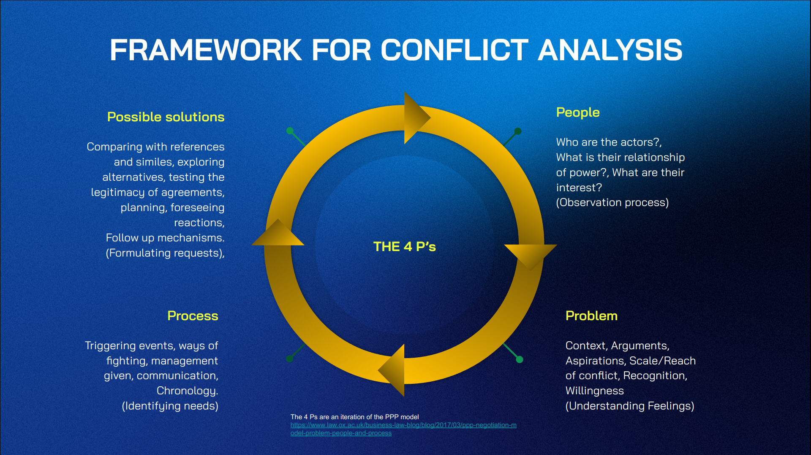
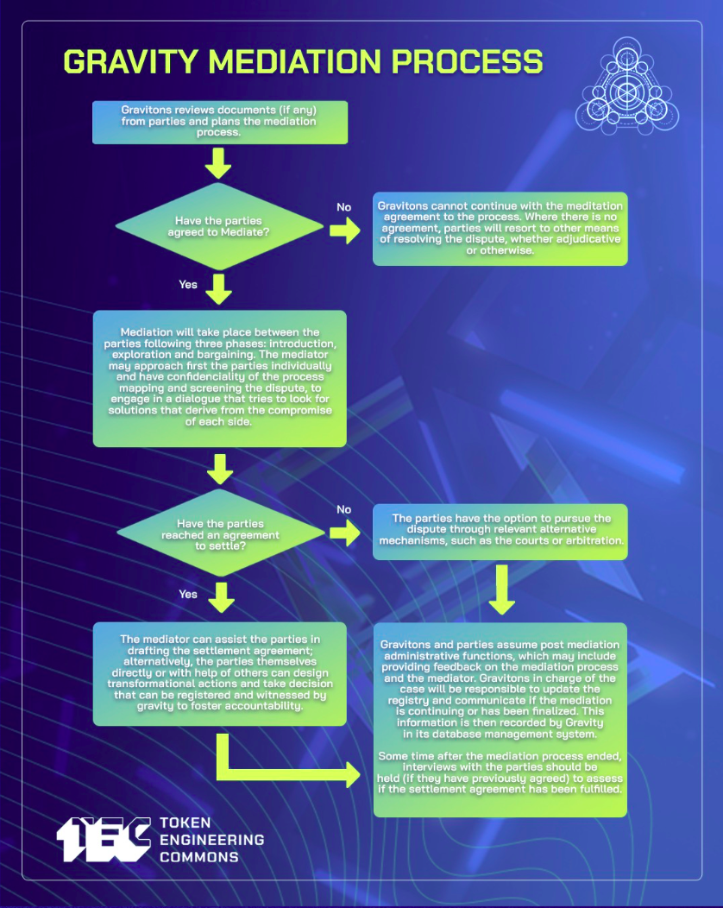
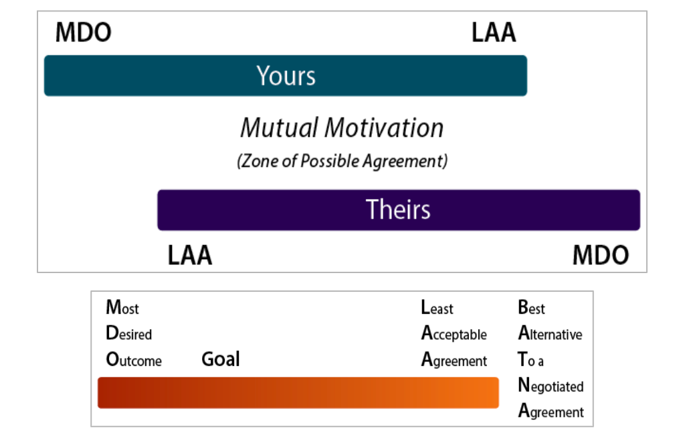
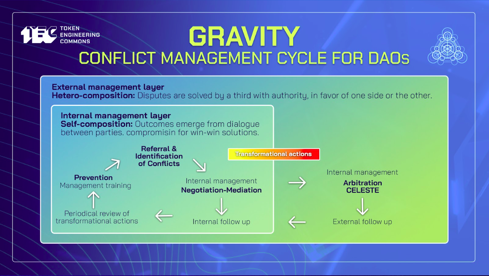

# Conflict Management

## Contents
- [Steps for Alternative Dispute Resolution](#steps-for-alternative-dispute-resolution)
- [THE 4 P’s - FRAMEWORK FOR CONFLICT ANALYSIS](#the-4-ps---framework-for-conflict-analysis)
  - [The 4 Ps key factors](#the-4-ps-key-factors)
  - [Gravity Mediation Process](#gravity-mediation-process)
  - [GUIDING QUESTIONS](#guiding-questions)
  - [GRAVITY FORMS](#gravity-forms)
  - [MAPPING OBSERVATION PROCESS BATNA](#mapping-observation-process-batna)
  - [KEEPING A REGISTRY FOR TRANSPARENCY AND ACCOUNTABILITY](#keeping-a-registry-for-transparency-and-accountability)
  - [Designing an agreement](#designing-an-agreement)
  - [OFNR + 4 Ps](#ofnr--4-ps)
- [Conflict Transformation](#conflict-transformation)
  - [Theories of Conflict, Antifragility and Conflict management](#theories-of-conflict-antifragility-and-conflict-management)
  - [Conflict Transformation Platform](#conflict-transformation-platform)
- [Assorted](#assorted)
- [Steps Typically Used by a Private ADR Center](#steps-typically-used-by-a-private-adr-center)
  - [Identify bright lines for formal legal process (including mediation/appeal)](#identify-bright-lines-for-formal-legal-process-including-mediationappeal)
- [Scalability of disputes](#scalability-of-disputes)
  - [Johan Galtung (Father of Peace Studies)](#johan-galtung-father-of-peace-studies)
    - [Collecting information from world religions ( Galtung’s Transcend Method )](#collecting-information-from-world-religions--galtungs-transcend-method-)
    - [Conflict management as a political philosophy](#conflict-management-as-a-political-philosophy)
  - [Francisco A. Muñoz - Qué son los conflictos](#francisco-a-muñoz---qué-son-los-conflictos)
  - [John Burton - Conflict Resolution](#john-burton---conflict-resolution)
  - [The Dialectic Cycle](#the-dialectic-cycle)
  - [Lederach - Conflict Transformation](#lederach---conflict-transformation)
  - [Transformative approach to conflicts](#transformative-approach-to-conflicts)
  - [J.P. Lederach. Conflict Transformational platform](#jp-lederach-conflict-transformational-platform)
  - [Framework for conflict analysis](#framework-for-conflict-analysis)
  - [J.P. Lederach. Conflict Transformational platform](#jp-lederach-conflict-transformational-platform-1)
    - [Conflict management as a political philosophy](#conflict-management-as-a-political-philosophy-1)
- [Conflict experiences](#conflict-experiences)
  - [Trusting the process](#trusting-the-process)
  - [Avoiding conflict is avoiding evolution](#avoiding-conflict-is-avoiding-evolution)
- [Resources](#resources)
- [references](#references)

## Steps for Alternative Dispute Resolution

**First**, One or more of the parties to a dispute approaches Gravity and requests support. Gravitons can also propose issues to manage and discuss.

**Second**, The parties provide the Gravitons assigned all the relevant information pertaining to the dispute and are invited to participate in a mediation process that requires their good will and involves a meaningful communication process with caucuses and 

**Third**, Gravity offers premises to frame the dispute in a non adversarial way and to conduct the mediation process aiming to reach a settlement agreement. Gravity keeps a copy of internal forms for evidence and registry.

**Fourth**, Gravity acts as a witness and facilitator of the settlement of the dispute and keeps track of agreements and follow up, but each part acquires responsibilities associated with implementation. if the issue persists, it can scale to other Dispute resolution mechanisms for arbitration or litigation.

## THE 4 P’s - FRAMEWORK FOR CONFLICT ANALYSIS

| | | 
| --- | --- |
| **Possible solutions**   Comparing with references and similes, exploring alternatives, testing the legitimacy of agreements, planning, foreseeing reactions, follow up mechanisms.   (Formulating requests) | **Problem**   Context, Arguments, Aspirations, Scale/Reach of conflict, Recognition, Willingness   (Understanding Feelings) |
| **Process**   Triggering events, ways of fighting, management given, communication,  Chronology.   (Identifying needs) | **People**   Who are the actors?, What is their relationship of power?, What are their interest?   (Observation process) |

The 4 Ps are an iteration of the PPP model [https://www.law.ox.ac.uk/business-law-blog/blog/2017/03/ppp-negotiation-model-problem-people-and-process](https://www.law.ox.ac.uk/business-law-blog/blog/2017/03/ppp-negotiation-model-problem-people-and-process) 

### The 4 Ps key factors

| Category | Variable | Definition | 
| --- | --- | --- |
| **People** | Main and secondary actors | Who and how many are the parties involved |
| | Power relationship between actors | Institutions and play rules |
| | Feeling of the actors in the conflict (perception) | Emotions triggered and needs at stake |
| **Problem** | Ingredients of the primordial soup | Context, factors that enable the conflict |
| | Faced arguments that boost the conflict | Central aspect of the dispute |
| | Interest that are represented by the parties | Desires, expectations and aspirations of the parties |
| | Reach of the conflict | Scale, status and potential impact of the conflict |
| | Acknowledgement of the conflict | Recognition of the conflictive situation by the parties |
| **Process** | Triggering events and escalation dynamics | facts that have marked the evolution of the conflict |
| | Ways that the conflict has developed | Forms of struggle, interaction with the conflict | 
| | How has the conflict been managed | Communication between actors, who are supportive third parts |
| | Chronology of the conflict | Timeline and time lapse of the situation |
| | Signals for possible escalation | Sensitive topics and actions that can trigger an escalation of the conflict |
| | Comparison with similar conflicts and references | Comparative method |
| **Possible solutions** | Exploring alternative paths for solutions | Multiple answers and possible ways that the conflict can unfold |
| | Legitimacy of decisions | mechanisms to make binding decisions |
| | Envision possible future scenarios | Prospecting and preventing social responses |
| | Mechanisms of implementation | Follow up and accountability for parties responsibility |
| | Short term responses | immediate actions with a direct impact on solving the dispute |
| | Long term transformative actions | Strategies that can help to prevent conflict and build trust | 

### Gravity Mediation Process

**Mediation flow** 
- Needs the good will of the parties to engage in a meaningful communication process, without this, there are other means of resolving disputes that can be more effective and efficient.
- We make caucuses (private meetings) with all the parties involved to identify common ground and prepare a joint conversation
- The post mediation process can be outlined in settlement agreements, but also gains legitimacy from follow up and implementation 

### GUIDING QUESTIONS 

Not talking about the past
Not pointing out individual responsibilities, avoid focusing on names
It's not necessary to make all the questions at once, when people start opening, catch the relevant information.

- How do we end something not desired and build something we do desire?
- Could you describe the conflicting situation that happened?
- What happened?
- Why do you think it happened?
- What would be the best possible outcome for you?
- What are you willing to compromise / negotiate in this process?
- What would be the worst case scenario for you in this situation?
- How would you like to feel after what happened? 
- What are your needs in this situation?
- What do you think can be done to restore the relationship and build trust?
- What can we learn from this?
- How can we apply these learnings?

### GRAVITY FORMS 
(FREE TO USE - JUST FORK THEM)

**First approach**: Hello XXXX How are you? my name is XXXX and Im a facilitator of conflict management in DAOs. Thank you for your input to the Gravity typeform. I'm reaching out with the intention of supporting meaningful communication processes, and building common ground for possible agreements that meet the needs of the parts involved. Would you be interested in having a meeting to talk on the issue? 

- [Observation form](https://docs.google.com/document/d/1LbytXdLBu3XC9BBTQA6aiZYPC02j-fxcRoiqtUDdGyg/edit)
- [Mediation form](https://docs.google.com/document/d/1RgL9QANBhq6KqtETCYEEEsFSJvHUw0K5VD58qWPUBTk/edit)
- [Venn Diagram (OFNR + 4Ps)](https://docs.google.com/presentation/d/1vZsWR6mO8aFRvpjuILmfVYlQXRVg_SxTvuvErjtinCg/edit?usp=sharing)

### MAPPING OBSERVATION PROCESS BATNA

### KEEPING A REGISTRY FOR TRANSPARENCY AND ACCOUNTABILITY
We use [Dework](https://app.dework.xyz/gravity-dao/trust-creation-trai), integrated with zenhub and Discord

### Designing an agreement

Google docs are ok, but we are soon moving to Unbreakable vows

https://unbreakable-vows.on.fleek.co/#/create

### OFNR + 4 Ps

## Conflict Transformation
- [Little book of conflict transformation](https://professorbellreadings.files.wordpress.com/2017/10/the-little-books-of-justice-peacebuilding-john-lederach-the-little-book-of-conflict-transformation-good-books-2014-1.pdf) (Lederach)
- [Conflict Transformation](http://peacebuildingforlanguagelearners.pbworks.com/w/file/fetch/73426925/Lederach%2520) By John Paul Lederach , Michelle Maiese
- [Conflict Transformation by Peaceful Means](https://www.issuelab.org/resources/19719/19719.pdf)
- [The little book of conglict transformation](https://professorbellreadings.files.wordpress.com/2017/10/the-little-books-of-justice-peacebuilding-john-lederach-the-little-book-of-conflict-transformation-good-books-2014-1.pdf)
- [Comentando el libro “Transformación de Conflictos” Pequeño manual de uso de John Paul Lederach.](https://drive.google.com/file/d/1bY_IQUtQeV76mbuLp4s6sRbrAFDOGVx-/view?usp=sharing)

### Theories of Conflict, Antifragility and Conflict management
**1. J. Paul Lederach, [little book of conflict transformation](https://professorbellreadings.files.wordpress.com/2017/10/the-little-books-of-justice-peacebuilding-john-lederach-the-little-book-of-conflict-transformation-good-books-2014-1.pdf)**
**2. Lederach Summary: [Conflict Transformation](http://peacebuildingforlanguagelearners.pbworks.com/w/file/fetch/73426925/Lederach) By John Paul Lederach , Michelle Maiese**
**3. (Español) [Resumen del libro de Lederach](https://drive.google.com/file/d/1bY_IQUtQeV76mbuLp4s6sRbrAFDOGVx-/view?usp=sharing)** 
**4. Taleb, [Antifragile. Things that gain from disorder](https://drive.google.com/file/d/1KiuG5ye52VikNqPPBCvm2D0AxvcJBNrm/view?usp=sharing)**
**5. (Video) [Antifragile](https://www.youtube.com/watch?v=S3REdLZ8Xis)**
**6. [Conflict management and peacebuilding in everyday life](https://www.reddbarna.no/Media/dokumenter/ResourceKit-web.pdf)**
**7. Galtung, [Conflict transformation by peaceful means](https://www.transcend.org/pctrcluj2004/TRANSCEND_manual.pdf)**
**8. (Español) [Qué son los conflictos](https://drive.google.com/file/d/1ovWrJw3w6t-opZQyB_fys71WbZnZ7we4/view?usp=sharing)** - Francisco A. Muñoz
**9. [Burton, Conflict resolution: Towards problem solving](https://core.ac.uk/DAOnload/pdf/51092982.pdf)** 

### Conflict Transformation Platform

## Assorted

>  We are preparing with this knowledge of techniques to understand conflict and to overcome and to transform it into something healthy. That is the purpose of gravity. 
> 
> The purpose of this training is for you to be able to practice in your everyday life techniques to handle conflict, to communicate mindfully and to make the best of a challenging situation.

* [Dana Caspersen’s 17 principles of conflict resolution Summary](https://www.psychologytoday.com/us/blog/fulfillment-any-age/201501/17-rules-guide-you-through-any-conflict)**
  > Conflicts trigger our deepest emotions. Just watch two young children battle over the same toy. Filled with sheer rage, they each grab at the toy, and each other, until one of them prevails (or the toy breaks).  Such conflicts set the stage for all of our adult struggles. The words we use may become more sophisticated, but the underlying feelings remain strikingly similar.
  > 
  > The key feature of the new Dana Caspersen’s book, [Changing the Conversation: The 17 Principles of Conflict Resolution](https://danacaspersen.com/book/), in my opinion, is its emphasis on these underlying emotions. This graphically-oriented how-to book takes the reader through her 17 principles in a way that allows you to understand each principle, its “anti-principle,” its focus, specific examples, a way to put it into practice, and the choice it presents.  Drawing from examples that range from relationships to office politics to parenting, Caspersen gives you the chance to understand what’s behind life’s everyday conflicts and how best, in turn, to consider handling them.
## Steps Typically Used by a Private ADR Center

### Identify bright lines for formal legal process (including mediation/appeal)

* optional/restorative/compulsory community service
* correct/muting/removal of prior communications on social channels
* suspension/expulsion as member/participation
* Monetary penalty … forced burning, transfer or lock-in of tokens
* Consider purchasing ADR tokens (alternative dispute resolution hours) from LexDAO for the complicated situations

Following a dialectical approach, there should be at least three filters required for the bot/typeform to accept a conflict management request inside the system and be able to start working around it.

A. Is this information true? (the caller signs the information sent)
*Calling for conflict management with false statements should be a low-mid sanction.

B. What are the social agreements at risk in this situation
*Sustaining how this behavior is contrary to the organization ethics.

C. Why is addressing this issue useful for the system?
*Stating how can the community/members benefit for a call on this issue

As the proposed authority comes from consensus, the sanctioned should accept the sanction (sign it) in order to be legitimate. If the sanctioned does not agree with the sanction or feels that they are being harmed in other ways, there can be a presentation of counter-arguments that will begin a negotiation process with a TEC SME in conflict management and the involved members to look for solutions.

## Scalability of disputes 

Following alternative mechanisms of conflict management, we can propose strategies to deal with the scaling of disputes that cannot be easily managed with the graduate sanctions. This scope involves the active participation of qualified third parties to play the role of facilitators that help building communication bridges in non consensual situations where the parts keep pushing away from each other. These are paths suggested to suit the complexity of conflicts.

1. Negotiation: - The issue is private -  Decisions can be settled easily between the parts and a SME in conflict management. Light sanctions can be applied.
2. Mediation: - The issue is still private - The parties can agree to ask for support from a group of trusted members inside the community (not related to any of the parties), to help find solutions. They will suggest a path to proceed, but the implementation of the decision depends on the consent of both parties involved. Yellow cards can be applied.
3. Conciliation: The issue is still private  – The parts can agree to ask for support from a group of trusted members inside the community (not related to any of the members) that helps in the design, voting, and implementation of solutions that should be respected by all parts. Red cards can be applied.
4. Arbitration: The issue becomes public after having exhausted the previous mechanisms without reaching agreements - The parts can call for help to an external organization – trusted by all parts (like kleros - aragon courts - Celeste)  - that should review the process and work towards regaining governance by proposing alternatives, that should be voted inside the system to be legitimated and implemented. Red cards can be applied.

Based on: https://dialnet.unirioja.es/descarga/articulo/4182033.pdf

### Johan Galtung (Father of Peace Studies)

* [Conflict management and peacebuilding in everyday life](https://www.reddbarna.no/Media/dokumenter/ResourceKit-web.pdf)
  > We recognise that there are some similarities and overlaps between the concepts of conflict and violence as both conflict and violence can cause damage and harm. However, there are also some important differences. One of the most important differences is that while VIOLENCE is always negative and harmful, CONFLICT can sometimes be positive, if we respond to it in a constructive way.
  > 
  > Here is an example of positive outcomes associated with conflict described by children and young people in Asia: Through conflicts we can sometimes learn from our mistakes... conflict can encourage new thinking patterns and positive change.... the conflict response can lead to more justice.

* Galtung, [Conflict transformation by peaceful means](https://www.transcend.org/pctrcluj2004/TRANSCEND_manual.pdf)

#### Collecting information from world religions ( Galtung’s Transcend Method )

- *following Hindu thought*, remember: Conflict the Destroyer and Conflict the Creator; conflict as a source of violence and conflict as a source of development. The conflict worker has the third role as Preserver, transforming the conflict by avoiding violence, promoting development.
- *following Buddhist thought*, remember: Codependent origination, everything grows together in mutual causation. Conflicts have no beginning and no end, we all share the responsibility; no single actor (like statesmen) carries all the responsibility (monopoly) and no single actor carries all the guilt.
- *following Christian thought*, remember: Ultimately, the responsibility for conflict transformation lies with individuals and their individual responsibility and decisions to act so as to promote peace rather than violence, and the principle of hope.
- *following Daoist thought*, remember: Everything is yin and yang, good and bad, there is the high likelihood that the action chosen also has negative consequences and that action not chosen may have positive consequences; hence the need for reversibility, only doing what can be undone.
- *following Islamic thought*, remember: The strength deriving from submitting together to a common goal, including the concrete responsibility for the wellbeing of all.
- *following Judaic thought*, remember: The truth lies less in a verbal formula than in the dialogue to arrive at the formula, and that dialogue has no beginning and no end.

#### Conflict management as a political philosophy

* **Conflict itself is not bad**. It is an expression of the diversity of interests, ideas and points of view. It arises in all human relationships and, like crises, can be excellent opportunities to grow, emerge stronger, learn and improve.
* When assuming conflicts are negative, people and institutions tend to fear them and adopt one of these two attitudes: 
  1) they resort to force, power or violence to crush them; or
  2) they ignore them hoping they will pass without addressing them.
* When a conflict arises, both parties may believe they have the only logical stance, since each sees the situation exclusively from their particular point of view. Hence the need and importance of dialogue, as a mechanism that allows the search for collectively constructed solutions through listening and incorporating the other’s perspective.
* **The quality of an institution is not determined by whether or not it has conflicts, but by how it manages to address them**.

* [PeacePower: Johan Galtung's Transcend Approach: Confederation in Iraq and a Middle East Community for Israel/Palestine](http://calpeacepower.org/0201/galtung_transcend.htm)
  > Transcend believes that all conflicts are born equal and have the same right to transformation; no conflict is "higher level" than another. Whether the solution lies in a shared national park or the creation of a community of six states, this philosophy ensures that each conflict is addressed by Transcend in the same, principled, peaceful and creative way. Galtung's visions for the peaceful solution of these current violent Middle Eastern conflicts represent peaceful, realistic and therefore compelling alternatives.     

### Francisco A. Muñoz - Qué son los conflictos

* (Español) [Qué son los conflictos](https://drive.google.com/file/d/1ovWrJw3w6t-opZQyB_fys71WbZnZ7we4/view?usp=sharing) - Francisco A. Muñoz
  > Hay un aspecto inicial que nos gustaría abordar. Si, como hemos visto en el apartado anterior, las personas y los grupos humanos estamos afrontando cotidianamente situaciones de conflictividad, que abordamos en la mayoría de los casos sin apenas esfuerzo y sin ser conscientes de ello, es decir si estamos continuamente regulando conflictos que colaboran a nuestro bienestar, no podemos ahora olvidarnos de ellos, hacer como si no existieran. 
  > 
  > [Una preocupación seria debe ser estudiarlos lo más rigurosamente posible para disponer de mayores recursos para la paz.](https://translate.google.com/?sl=auto&tl=en&text=Hay%20un%20aspecto%20inicial%20que%20nos%20gustar%C3%ADa%20abordar.%20Si%2C%20como%20hemos%20visto%20en%20el%20apartado%20anterior%2C%20las%20personas%20y%20los%20grupos%20humanos%20estamos%20afrontando%20cotidianamente%20situaciones%20de%20conflictividad%2C%20que%20abordamos%20en%20la%20mayor%C3%ADa%20de%20los%20casos%20sin%20apenas%20esfuerzo%20y%20sin%20ser%20conscientes%20de%20ello%2C%20es%20decir%20si%20estamos%20continuamente%20regulando%20conflictos%20que%20colaboran%20a%20nuestro%20bienestar%2C%20no%20podemos%20ahora%20olvidarnos%20de%20ellos%2C%20hacer%20como%20si%20no%20existieran.%20%0A%0AUna%20preocupaci%C3%B3n%20seria%20debe%20ser%20estudiarlos%20lo%20m%C3%A1s%20rigurosamente%20posible%20para%20disponer%20de%20mayores%20recursos%20para%20la%20paz.%0A&op=translate) 

### John Burton - Conflict Resolution

* [Burton, Conflict resolution: Towards problem solving](https://core.ac.uk/download/pdf/51092982.pdf)
  > Societies remain power-elite dominated. The diversion of resources to provide education and other services on an equitable basis is being increasingly resisted. Funds are being cut. There is a retreat to specialization, and a holistic approach to problems is politically unpopular. But if civilizations are to survive the contemporary trend towards increased crime and violence at all social levels has to be dealt with by means which eliminate it, rather than merely contain it within less privileged regions. Civilizations must, if they are to survive, move from power-elite politics to problem-solving. It is the responsibilities of universities in particular to bring these issues to attention, and to give students in all disciplines the opportunity to question, to explore and to innovate. This new a-disciplinary study, Conflict Resolution, provides an opportunity
  
Maybe when you had that conflict, it seemed something really big and something that wasn't going to solve. Now, you can see that conflict as a gift, as an opportunity that taught you something as an and as an opportunity for you to grow. 

### The Dialectic Cycle

(00:17:55)

I've been talking about dialectics and about the dialectic cycle and the difference between a monologue and a dialectic cycle is if a monologue, then the thesis is the same each point of the spiral, but here, and this is related to what we saw in the first session of a spiral dynamic. 

Here, we can see development as spiral, but this is something that has pieces and thesis and synthesis is because of the incorporation of the antithesis that you can have synthesis is not an end state of truth. That synthesis always have anthesis. 

That always, that also leads us. That is the process of what, what, how can we see the conflict contr our, our dialogue. This is I'm Hager, but here we can also see how mark about this dialectic cycle in his theory of dial dialectical materialism, that is the, like the division of classes.  

The fight between classes is what leads us to evolution in our institutions. This conflict between classes is what is taking us to another place. I still feel that we are in the era of capitalism because we are, we have this fight of classes between the work, you see the very rich people and the people that is not in this position of economic profit of advantage from the economic system. 

I think that in, because of this conflict that we are having right now, we are also having new and alternative ways of seeing social structures as dos and as all the decentralized world that I can see as a response to the conflict between that we have in our economic system, between rich people and poor people.  

I would really like go deeper into mark, but this is not like the purpose of this topic of this, of this session, but he states the difference between the value of use and the value of exchange. I think that we are still stuck in, in that division where we give value to what can be exchanged and not give value to what we can use or what we need. 

It's like a change of paradigm that we are, that we are still, and even to under, to reflect on how do we measure human labor, because we are measuring human labor, according to what is productive to the economic system. We are not giving the value to human just for the essence of living, being part of a society and being part of this world.  

I think this is something that is amazing. and to live in this moment, because this whole boom of UBIs and this Bo boom of the centralized economies and of dos is something that is also looking to change that the way we distribute the resources in our, in our economy, and also the way how we value humans. 

I feel more valued in this community, in this decentralized community of the TC that I feel in my own country. For me, this is a very good way to avoid some of the, of the, of the conflicts that we have right now with our institutions and with our government.  

### Lederach - Conflict Transformation

* J. Paul Lederach, [little book of conflict transformation](https://professorbellreadings.files.wordpress.com/2017/10/the-little-books-of-justice-peacebuilding-john-lederach-the-little-book-of-conflict-transformation-good-books-2014-1.pdf)
  > As a starting point, let us explore the differences between the terms look and see. To look is to draw attention or to pay attention to something. In everyday language we often say, “Would you look over here please!” or “Look at that!” In other words, looking requires lenses that draw attention and help us become aware. To see, on the other hand, is to look beyond and deeper. Seeing seeks insight and understanding. In everyday language we say, “Do you see what I mean?” Understanding is the process of creating meaning. Meaning requires that we bring something into sharper focus.
  > 
  > **Conflict transformation is a way of looking as well as seeing.**
  > 
  > Conflict transformation is more than a set of specific techniques; it is a way of looking as well as seeing. Looking and seeing both require lenses. So conflict transformation suggests a set of lenses through which we view social conflict.

### Transformative approach to conflicts
* Conflict is an opportunity, a gift. Conflict is normal in human relationships, and conflict is a motor of change.
* Rather than seeing peace as a static “end-state, ” conflict transformation views peace as a continuously evolving and developing quality of relationship.
* Conflict transformation is to envision and respond to the ebb and flow of social conflict as life-giving opportunities for creating constructive change processes that reduce violence, increase justice in direct interaction and social structures, and respond to real-life problems in human relationships.
* Transformation’s guiding question is this: How do we end something not desired and build something we do desire?

* Lederach Summary: [Conflict Transformation](http://peacebuildingforlanguagelearners.pbworks.com/w/file/fetch/73426925/Lederach) By John Paul Lederach , Michelle Maiese
  > *what are useful lenses* that bring varying aspects of conflict complexity into focus and at the same time create a picture of the whole? *This essay will suggest three*.
  > 
  > **First**, we need a lens to see the immediate situation.\
  > **Second**, we need a lens to see past the immediate problems and view the deeper relationship patterns that form the context of the conflict. This goes beyond finding a quick solution to the problem at hand, and seeks to address what is happening in human relationships at a deeper level.\
  > **Third**, we need a lens that helps us envision a framework that holds these together and creates a platform to address the content, the context, and the structure of the relationship. From this platform, parties can begin to find creative responses and solutions. 

* (Español) [Resumen del libro de Lederach](https://drive.google.com/file/d/1bY_IQUtQeV76mbuLp4s6sRbrAFDOGVx-/view?usp=sharing) 
  > [Objetivos del cambio en la transformación del conflicto](https://translate.google.com/?sl=auto&tl=en&text=Objetivos%20del%20cambio%20en%20la%20transformaci%C3%B3n%20del%20conflicto%0A%0APersonal%0A%0A-%20Minimizar%20los%20efectos%20destructivos%20del%20conflicto%20social%20y%20maximizar%20el%20potencial%20de%20crecimiento%20y%20bienestar%20de%20las%20personas%20como%20seres%20humanos%20individuales%20en%20el%20terreno%20f%C3%ADsico%2C%20emocional%2C%20intelectual%20y%20espiritual.%20%0A%0ARelacional%0A%0A-%20Minimizar%20la%20comunicaci%C3%B3n%20que%20funciona%20de%20forma%20pobre%20y%20maximizar%20la%20comprensi%C3%B3n.%0A-%20Sacar%20a%20la%20luz%20los%20miedos%20y%20esperanzas%20relacionadas%20con%20las%20emociones%20y%20la%20interdependencia%20de%20las%20relaciones%20y%20trabajarlas.%0A%0AEstructural%0A%0A-%20Entender%20y%20afrontar%20las%20ra%C3%ADces%20de%20las%20causa%20y%20las%20condiciones%20sociales%20que%20provoquen%20la%20aparici%C3%B3n%20de%20expresiones%20violentas%20y%20nocivas%20del%20conflicto.%0A-%20Promueve%20mecanismos%20no-violentos%20que%20reduzcan%20la%20confrontaci%C3%B3n%20y%20que%20minimicen%20y%20en%20%C3%BAltima%20instancia%20eliminen%20la%20violencia.%0A-%20Promover%20el%20desarrollo%20de%20estructuras%20para%20satisfacer%20las%20necesidades%20humanas%20b%C3%A1sicas%20(justicia%20substantiva)%20y%20para%20maximizar%20la%20participaci%C3%B3n%20de%20la%20gente%20en%20las%20decisiones%20que%20afectan%20sus%20vidas%20(justicia%20procesal).%0A%0ACultural%0A%0A-%20Identificar%20y%20entender%20los%20patrones%20culturales%20que%20contribuyen%20a%20la%20aparici%C3%B3n%20de%20las%20expresiones%20violentas%20del%20conflicto.%0A-%20Identificar%20y%20construir%20recursos%20y%20mecanismos%20dentro%20de%20un%20escenario%20cultural%20para%20responder%20constructivamente%20al%20conflicto%20y%20gestionarlo.&op=translate)
  > ##### Personal
  >   - Minimizar los efectos destructivos del conflicto social y maximizar el potencial de crecimiento y bienestar de las personas como seres humanos individuales en el terreno físico, emocional, intelectual y espiritual.
  > ##### Relacional
  >   - Minimizar la comunicación que funciona de forma pobre y maximizar la comprensión.
  >   - Sacar a la luz los miedos y esperanzas relacionadas con las emociones y la interdependencia de las relaciones y trabajarlas.
  > ##### Estructural
  >   - Entender y afrontar las raíces de las causa y las condiciones sociales que provoquen la aparición de expresiones violentas y nocivas del conflicto.
  >   - Promueve mecanismos no-violentos que reduzcan la confrontación y que minimicen y en última instancia eliminen la violencia.
  >   - Promover el desarrollo de estructuras para satisfacer las necesidades humanas básicas (justicia substantiva) y para maximizar la participación de la gente en las decisiones que afectan sus vidas (justicia procesal).
  > ##### Cultural
  >   - Identificar y entender los patrones culturales que contribuyen a la aparición de las expresiones violentas del conflicto.
  >   - Identificar y construir recursos y mecanismos dentro de un escenario cultural para responder constructivamente al conflicto y gestionarlo.

### J.P. Lederach. Conflict Transformational platform

(00:22:53)
Now I want to go back to Lederach and what he calls a transformational platform. If we see that evolution comes from an, an spiral process and an, a dialectic process from this is from thesis and thesis and synthesis, we can see this transformational platform as something that promotes and accept the inputs from the system to deliver answers that are dynamic and that dynamized and speed up the change process instead of slowing it. 

Instead of having like institutions that they just want to prevail and prevail over time, we could have institutions that than more than prevailing over time, they just want to improve, and they accept their own weakness to see how can they improve. 

A transformational platform, according to Lederach is short time responses and long term strategic is strategic. Because if you can conflict in a short period in a short term, then you can address conflict in a longer term. That gives you resilience. 

It short term responses, because it can process the conflicts that we are having this moment to catalyze the change and the learn, and the learnings that is within that conflict. That transformational platform has the capacity to generate and regenerate change processes from the immediate episodes and the relational context. 

I think that this is the way that we should build our institutions, and this is a way that we should build our dos so that they, they can respond to the, to the, to the things that happen and that they can innovate and that they can learn from their own mistakes.  

### Framework for conflict analysis

(00:25:16)

We are talking about this is spiral process that has to move to evolve, but how can we like catalyze conflict into something good? And I am proposing this framework for conflict analysis that is based on the three piece, but here are four piece and relating it to the process of nonniolent communication. 

When conflict arises, you have to start an observation process to see who are the actors, what is their relationship of power? What is their interest? You have to observe the problem without judgment, like without having any personal interest, you have to see the conflict as if as an exterior, as an even within yourself. 

Then you can understand the feelings and understand the intention of, of why the problem arose. For that, need to understand the context, the arguments of that are faced the aspirations that is big behind each argument, and try to measure the scale and the reach of the conflict so that you can like also understand that when a conflict is too big, there's no management Mar margin.  

Sometimes you just need to give time to the conflict or wait for the conflict to like calm DAOn a bit so that you can act with it. You have to have recognition from both parts of the conflict and willingness to solve that. If we have these two steps, then we can go to the process of identifying needs from the conflict. 

Identifying what were the triggering events, what are the ways of fighting and what would be the best ways to address this conflict? What has been the management given and how can we improve that management? How has been the communication between the parts and how has the conflict been evolving over time? 

Then, we can identify the needs in order to propose possible solutions that can be seen as formulating requests.  

To propose possible solutions, we need to compare with reference and signals, because sometimes we think that a conflict is the first time that is happening. But as conflict is something that has been with humans through all history, it's very difficult. 

That is a conflict that anyone has had. Our conflicts can have reference and signals and we can learn from other mistakes and learn from other ways of handling their issues. To put in practice debt and we to keep looking for solutions, we need to explore alternatives testing for the legitimacy of the agreements. 

Sometimes we can propose a solution that it's not legitimate. In order to propose solution, this is a very careful process where you need to understand the needs and the feelings to be able to propose a situation that can be better from the initial situation. 

We need to do a lot of planning and foresee reactions so that the things that happen don't, don't have a surprise, and also having follow up mechanisms to have like that the solution is being implemented. 

We can have a cycle to address a conflict and transform that conflict into something constructive rather than something destructive.  

### J.P. Lederach. Conflict Transformational platform

(00:45:42)
**Juan Carlos**:    so that we are not a monologue in our heads. and reality is our expression of our thinking. But to see this reality as a dialogue and as a process, that constantly is evolving from the interaction with the other person. With this, I want to go with the final section in this of this section of this talk, and is that conflict management can also be seen as a political philosophy because conflict is itself is not bad. It is an expression of the diversity of interest ideas, and points of view. It arises in all human relationships, like crisis can be excellent opportunities to grow, emerge, stronger, learn, and improve. That when assuming that conflicts are negative people and institutions tend to fear them and adopt one of these two attitudes, they refer to force, or they ignore them. Neither of them is trying to transform the conflict into something positive.  

#### Conflict management as a political philosophy

* **Conflict itself is not bad**. It is an expression of the diversity of interests, ideas and points of view. It arises in all human relationships and, like crises, can be excellent opportunities to grow, emerge stronger, learn and improve.

* When assuming conflicts are negative, people and institutions tend to fear them and adopt one of these two attitudes: 
1) they resort to force, power or violence to crush them; or
2) they ignore them hoping they will pass without addressing them.

* When a conflict arises, both parties may believe they have the only logical stance, since each sees the situation exclusively from their particular point of view. Hence the need and importance of dialogue, as a mechanism that allows the search for collectively constructed solutions through listening and incorporating the other’s perspective.

* **The quality of an institution is not determined by whether or not it has conflicts, but by how it manages to address them.**

When you refer to force, you en enable the change that comes with conflict. When you ignore them, you are also enabling yourself from, from the opportunity of addressing the conflict. 

Instead of letting things go or just fighting with them, we need to seek conflict and understand it and put our efforts into improving from the initial situation that we had. so as how can we include ours in the next synthesis that we are going to have, or how can we use the synthesis to make our ideas better and stronger?  

(00:47:36)
**Durgadas**:    Can I just point out Juan, the second point that you're making here is something which is encompassed in the Ragas and Damas duality that I gave you a graphic about, that you talk about a lot that's expanded upon in that decolonization talk.  

(00:47:59)
**Juan Carlos**:    Yes. When conflict arises, both, both parties believe that they have the only logical since as we saw in the first image, each one sees the situation exclusively from the particular point of view, but the dialogue is the mechanism that allows to search for constructed solutions through listening and incorporating the perspective. 

The final message that I am going to give with this section of the talk is that the quality of an institution is not determined by whether or not this has conflict, but how it manages to address them. This is something that is also related to a Ostro, because what we have learned by reading governing the comments is that the endurance of the common pool resources. 

The common pool resources, institutions, and settings, is really critical to how that do they manage their conflict. The endurance of this situations relates to how the people communicate and how, and how the people can transform the things that can be like external or internal variables into their best institutional choice. 

## Conflict experiences

(01:01:50)
**Juan Carlos**:  I want to share with you like my personal experience. I had a restaurant like five years ago and the restaurant was going good. But I felt that if I stood, like with that restaurant, I wasn't going to like, achieve all of my goals. When I decided to close that restaurant, it was a big conflict for me because I decided it to start doing other, other things.  

(01:03:13)
**Juan Carlos**:    And I didn't have like that economical sustain that the restaurant gave me. It was really hard for me, but right now I can see that conflict that I had as a gift, because that has brought me to enter into the academic world in universities, and also to be entering here in this, in, in this, the community. Yes, it, it is something that you all can do, like privately and just talk, talk to yourself like that, like how a conflict or a situation just made you better, you learn from it. that is like the workshop that I want you to do. If someone wants to share it's free and if you don't want to share, there's no problem.  

(01:04:12)
**Griff**:    I can definitely share. We can just go around. I have a couple big ones. I mean, The DAO was obviously quite the conflict, but I'll let that one go. I had another conflict, but the DAO was great, cuz I was, I became a community leader through it and it was very nice. 

There's another, before the DAO, I was a community org "Save our Sonics" organization, which was an effort to keep this NBA basketball team that I was obsessed with in Seattle. I was basically general of the fans and I rallied the troops, got people, sign petitions and all of these things, we even had this, I helped organize this giant rally at a courthouse where there was a, there was a moment where we were really going to win. There was a, basically the Seattle city made a deal with the Seattle Supersonics that they would upgrade key arena.  

But there was a clause that said they had to stay there for 15 years. They'd only been there for 12 years. and the guy who bought the Sonic was gonna take the team away. So, I mean, I got to meet like all my favorite heroes from the NBA team. We had a rally at the courthouse to like make this, to show the support of the city. 

The day the judge was gonna give the verdict, it was actually postponed and not done because the mayor just decided to sign away the team and the team left. There was nothing we could do about it. Despite what we had done as a community, the mayor was able to circumvent the courts and let the team leave. I was distraught. It was a major turning point in my life. I decided to basically become a nomad and travel the world and discover cryptocurrency, not feel like I was attached to the Seattle Supersonics or this or the United States in general. I became a leader in other communities that were actually way more basketball team, like who cares? I think a lot of people could speak to this, that a lot of the times, the worst things that happen to people are the best things that happen to people.  

(01:07:27)
**Juan Carlos**:    Yeah. All of us have, have conflicts and I mean, we wouldn't be human if we don't have conflicts and conflict is what keeps us changing and motivating and alive. It's just very, yeah. Humans said that we have conflicts and that, and that we are always going to keep them having them. 

It's important just to see them as an expression of how can we improve and how can we learn so well, if anyone wants to share another story.

(01:08:32)
**Speaker 8**:    I can think of several instances over the years on my journey where I've had a challenge or a conflict. At the time I think now I'm able to reflect. Even in current situations that may be challenging. I can look at them more objectively and I see where I think everybody has triggers around different things and different assumptions and different ways that they've been conditioned or raised to handle conflict. 

I think what I love most about your work one and in this group and having a space is to normalize this and what you're saying about this is completely normal. I think like 90% of the population has this tendency to contract, to avoid and to yeah. Mostly avoid. I think, and the more we can like open to this, but to be able to open, you have to feel like safe to be vulnerable.  

This level of comfort is different with different people and different relationships. But I think like one on one it's okay. But I feel like the more people you add to like a space or the more people you add, the kind of maybe the less trust or the more contraction, because it feels like, is it okay to really open to these people?

I think part of that, is it okay? Yeah. It has to be like the right space and environment and the intention of the group going in like, okay, we're gonna, this might be awkward. This might be really uncomfortable, but let's go into it because probably we're gonna have, I like this ability to transform it to a place where disconnection can become connection. Thanks for holding this space for us.

> The idea is to understand that conflict is normal, we all have conflicts, and also to reach and to ask for help. 

### Trusting the process

**Durgadas**:    The very first nonviolent communication group that I founded in Seattle when I left the Ashram, there was a guy who was just there. For the first moment that I was just irritated to hell with him. I just don't know why everything he said and did was just irritating to me. and at some point I realized that I'm in a nonviolent communication group, I should actually be able to trust the process to sort out what that it was.

After about eight meetings, I was like, look, man, you're just irritating as hell to me. I don't know why. I had to trust the process to have a difficult conversation with that person. We were able to talk it out and trust the process and go through the observations, feelings needs and requests, and then sort out what, what that was all about. It ended up really well, then he was no longer annoying. This is the power of inclusion.

It was a bit like cracking the shell of an egg. Now I haven't looked back and I realize that my own maturity as a person is basically dependent on my willingness to continue sort of cracking those individual eggs as I encounter them. Now it's just, all I really do is look for ways in which to crack those eggs and get to the meaty stuff that's that's inside of them.

### Avoiding conflict is avoiding evolution
(01:09:35)
**Juan Carlos**:    I want to compliment also on something and that this all connects with what we are going to see next week on the theories of conflict, because conflict is somehow like the expression of an ENT duality. How can we transform an toity that arises between two people into something that can be better for, for the, for both of them.  

(01:10:06)
**Durgadas**:    that, and that's specifically what this evolution is showing, right? It's actually conflict that creates a person's evolution along the different colors.  

(01:10:17)
**Juan Carlos**:    So it, it, sometimes we, when we hear the word conflict, we tend to like avoid it. Yeah. Avoiding a conflict is avoiding evolution. Yes. Because is expression of, of different points of view, it's expression of needs that are not met. An approach that we're promoting here is to see is to not go into conflict with everything, but see conflict with compassion, with, as a process that has a lot of knowledge in need. I am also going into this next session, but it's also a dialectic process, a process that comes from a thesis and antithesis, and then it a synthesis that it's like what we are seeing here in this, in these graphs.  

## Resources

- [The Window of tolerance](https://worthit2bme.com/fightflightimmobolize/therapeutic-window-of-tolerance/)
- Lederach [Summary](http://peacebuildingforlanguagelearners.pbworks.com/w/file/fetch/73426925/Lederach%20):
- [Antifragile](https://drive.google.com/file/d/1KiuG5ye52VikNqPPBCvm2D0AxvcJBNrm/view?usp=sharing) (pages 16-17) - N. Taleb.
- [True self and false self in organizations](https://drive.google.com/file/d/1aXszmXnVCF_LN09mqBs_goDBR0cCj1Ay/view?usp=sharing) (Just read the conclusions)
- [Ho’oponopono reconciliation ritual 3](https://www.youtube.com/watch?v=OAuWRuU4uzA)
- [Jur](https://jur.io/) – Justice. Decentralized
- [Conflict Resolution: Towards Problem Solving – John Burton](https://core.ac.uk/download/pdf/51092982.pdf)
- [How to solve conflict in a community of equals](https://media.ccc.de/v/rc3-channels-2020-125-how-to-solve-conflict-in-a-community-of-equals) 
  > This talk provides a practical guide for how to solve interpersonal conflict in communities with a loose structure such as do-ocracy or anarchy
- [The Great Courses - Art of Conflict Managment](https://www.thegreatcourses.com/courses/art-of-conflict-management-achieving-solutions-for-life-work-and-beyond) 
- [Dominic Barter - Dedicated spaces for having conflicts](https://www.youtube.com/watch?v=xhi8sxCPkvo) 
- [Dominic Barter - Understanding justice as a system](https://www.youtube.com/watch?v=z-CIeYopMnM) 
- [A New Way to Look at Conflict Resolution - How to Have Healthy Workplace & Community Relationships](https://www.youtube.com/watch?v=SNw1z3VDWsI) 
  > Looking for a new way to look at conflict resolution in 2020? What is conflict, what causes it, and how can it be resolved? This video is all about having th...
- [Potential in the ebb and the flaw](https://thinkingthursdays.substack.com/p/potential-in-the-ebb-and-the-flaw?s=w) 
  > Conflict is an opportunity and we might even need metrics for it
- [ConflictManagementQuestionnaireInfo.pdf](https://drive.google.com/file/d/1F_RlybbM-VJNzwSR5kVm9HpSEIt14Hp0/view?usp=drivesdk)
  > The Conflict Management Formative Questionnaire is designed to measure a student’s proficiency in the three essential components of conflict management, which are:
  > 1. Understand your natural response to conflict.
  > 2. Understand the context of the conflict, including the perspectives of all involved.
  > 3. Apply a conflict management approach that is appropriate to the situation.
- [estimating-the-costs-of-workplace-conflict.pdf](https://drive.google.com/file/d/1NrYQn9m78oh3MO4vucEyX-CpgPwP3Ush/view?usp=drivesdk)
  > In particular, it is argued that organisations have tended to place too much emphasis on developing leaders concerned with strategy, while overlooking the importance of encouraging excellence in core management practices such as the management of poor performance, which are incorrectly seen as 'basic' and 'easy to replicate' (see endnote 3).
- [The Art of Conflict Management: Achieving Solutions for Life, Work, and Beyond](https://drive.google.com/file/d/1pSDbTy_lWK2IT2tmxA64nbcD1SX66WVf/view?usp=drivesdk)
- [Conflictology_Vinyamata_2010.pdf](https://drive.google.com/file/d/1-VJKNldCZcQ1Rx4_D4UbqI1287QQHWvl/view?usp=drivesdk)
- [ensayo_conflicto.docx](https://docs.google.com/document/d/1UwJUwGTjvXdvz1xvSxG-J_6qlZWyo0k4/edit?usp=drivesdk&ouid=103365208332858066119&rtpof=true&sd=true)
- [conflictos_y_estrategia.pptx](https://docs.google.com/presentation/d/1L_JV_6FtwaZqa0CBb7KYbBAulx5wpI7r/edit?
- [Methodological guide for conflict analysis Juan_Bell](https://drive.google.com/file/d/1LWrfda76p6Qc57Uzt-SagkimYGiBHmcs/edit) 

##  references 
- Harvard’s program on negotiation
- The Mexican Cooperative law gives some examples of conflict resolution within a cooperative
- [Restorative Justice Circles](https://oscr.umich.edu/article/restorative-justice-circles)
- https://docs.google.com/document/d/18GF3f130miEsaASw-TRCHR-qRtbL8y-UsfusV7pXuZg/edit# D2D reputation sharing
- https://handbook.enspiral.com/agreements/catalyst Enspiral “catalyst”
