# Trust Creation

- [The collective consciousness Iceberg](#the-collective-consciousness-iceberg)
- [Liberating Structures Toolbox](#liberating-structures-toolbox)
- [Ho Oponopono](#ho-oponopono)
- [No difference between legitimacy of social law and other types of law.](#no-difference-between-legitimacy-of-social-law-and-other-types-of-law)
- [Making rules is not just blindly following a system.](#making-rules-is-not-just-blindly-following-a-system)
- [Correcting contradictory social law behavior](#correcting-contradictory-social-law-behavior)
- [Promoting strategic nonviolent communication](#promoting-strategic-nonviolent-communication)
  - [Group Activity](#group-activity)
- [Gravity WG Practice](#gravity-wg-practice)
- [Trust creation durgadas](#trust-creation-durgadas)
- [CREATING A SAFE SPACE](#creating-a-safe-space)
  - [Empathy is the key](#empathy-is-the-key)
- [HELPING PEOPLE TO GET TO THEIR OPTIMAL AROUSAL ZONE](#helping-people-to-get-to-their-optimal-arousal-zone)
- [Overcoming communication constraints](#overcoming-communication-constraints)
  - [Nonviolent Communication (Giraffe / Wolf language)](#nonviolent-communication-giraffe--wolf-language)
- [The four components of NVC](#the-four-components-of-nvc)
  - [OFNR:](#ofnr)
  - [Accountability](#accountability)

## Resources

- [Beyond Inclusion Beyond Empowerment : Primer](https://soundcloud.com/aloysious-x/beyond-inclusion-beyond-empowerment-primer) 
  > Beyond Inclusion, Beyond Empowerment, by Leticia Nieto Psy.D., and co-authors, brings a long-awaited breakthrough to the fields of liberation and cultural studies. Nieto offers a powerful analysis
- [TEC icebreaking game — Gatheround — Crack the culture code](https://icebreaker.video/events/GRgR0mLvZk3CaYKMpOBO) 
  > Let’s know a little bit more about each other!
- [Building trust and resolving conflict25](http://textbooks.whatcom.edu/healthprofessionalism/chapter/building-trust-and-resolving-conflict/)

### The collective consciousness Iceberg

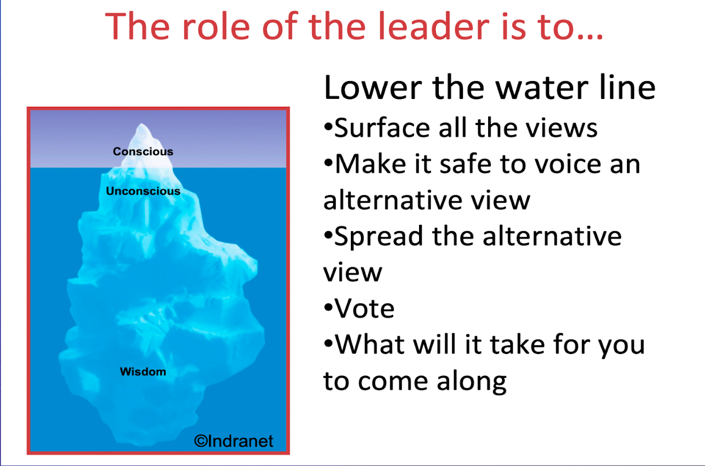

### Liberating Structures Toolbox

Liberating Structures is an open tool-kit for facilitation.

| | | |
|---|---|---|
|    **1-2-4-All**   Engage everyone simultaneously in generating questions/ideas/suggestions | [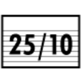](https://www.liberatingstructures.com/12-2510-crowd-sourcing/)   **25-To-10 Crowd Sourcing**   Rapidly generate & sift a group’s most powerful actionable ideas |    **What I Need From You**   Surface essential needs across functions and accept or reject requests for support |
| [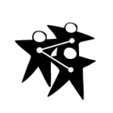](https://www.liberatingstructures.com/2-impromptu-networking/)   **Impromptu Networking**   Rapidly share challenges and expectations, building new connections | [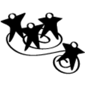](https://www.liberatingstructures.com/13-wise-crowds/)   **Wise Crowds**   Tap the wisdom of the whole group in rapid cycles | [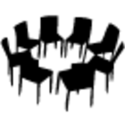](https://www.liberatingstructures.com/25-open-space-technology/)   **Open Space**   Liberate inherent action and leadership in large groups |
|    **9 Whys**   Make the purpose of your work together clear |    **Min Specs**   Specify only the absolute “Must do’s” & “Must not do’s” for achieving a purpose |    **Generative Relationships**   Reveal relationship patterns that create surprising value or dysfunctions |
|    **Wicked Questions**   Articulate the paradoxical challenges that a group must confront to succeed |    **Improv Prototyping**   Develop effective solutions to chronic challenges while having serious fun |    **Agreement-Certainty Matrix**   Sort challenges into simple, complicated, complex and chaotic domains | 
|    **Appreciative Interviews**   Discover & build on the root causes of success |    **Helping Heuristics**   Practice progressive methods for helping others, receiving help, and asking for help |    **Simple Ethnography**   Observe and Record Actual Behaviors of Users in the Field | 
|    **TRIZ**   Stop counterproductive activities & behaviors to make space for innovation |    **Conversation Café**   Engage everyone in making sense of profound challenges |    **Integrated~Autonomy**   Move from either-or to robust both-and solutions |
|    **15% Solutions**   Discover & focus on what each person has the freedom and resources to do now |    **User Experience Fishbowl**   Share know-how gained from experience with a larger community | [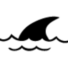](https://www.liberatingstructures.com/30-critical-uncertainties/)   **Critical Uncertainties**   Develop strategies for operating in a range of plausible yet unpredictable futures |
|    **Troika Consulting**   Get practical and imaginative help from colleagues immediately |    **Heard, Seen, Respected**   Practice deeper listening and empathy with colleagues | [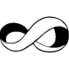](https://www.liberatingstructures.com/31-ecocycle-planning/)   **Ecocycle Planning**   Analyze the full portfolio of activities & relationships to identify obstacles and opportunities for progress |
|    **What, So What, Now What?**   Together, look back on progress to-date and decide what adjustments are needed |    **Drawing Together**   Reveal insights & paths forward through non-verbal expression |    **Panarchy**   Understand how embedded systems interact, evolve, spread innovation, and transform |
| [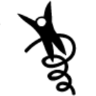](https://www.liberatingstructures.com/10-discovery-action-dialogue/)   **Discovery & Action Dialogue**   Discover, spark & unleash local solutions to chronic problems | [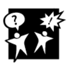](https://www.liberatingstructures.com/21-design-storyboards/)   **Design StoryBoards**   Define step-by-step elements for bringing projects to productive endpoints |    **Celebrity Interview**   Reconnect the experience of leaders and experts with people closest to the challenges at hand | 
| [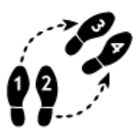](https://www.liberatingstructures.com/11-shift-share/)   **Shift & Share**   Spread good ideas and make informal connections with innovators | [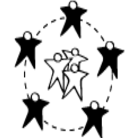](https://www.liberatingstructures.com/23-social-network-webbing/)   **Social Network Webbing**   Map informal connections & decide how to strengthen the network to achieve a purpose |    **Purpose-To-Practice**   Define the five elements that are essential for a resilient & enduring initiative |

### Ho Oponopono

* ありがとう - Te Amo - Désolé - I’m sorry
* Gracias - Je t’aime - Forgive me, ごめんなさい
* Thank you - 愛してる - Lo siento - Pardonnez-moi
* Merci - I love you - すみません - I’m Sorry

[https://www.youtube.com/watch?v=OAuWRuU4uzA](https://www.youtube.com/watch?v=OAuWRuU4uzA)

## No difference between legitimacy of social law and other types of law.

Following the principles of self governance and self sovereignty, despite the lack of central authorities, we can rely on the social acceptance of internal contracts to create binding procedures, as a basis for participation inside the community.

The point of these processes[k][l] (to have clear roles in the organization played by a group of people accountable of managing the disputes sent to the system, by periodically applying and reviewing transformational actions, and conflict management scaling protocols for complex problems) are to be able to have antifragile systems that set guidelines for resisting frictions in human interaction. 

## Making rules is not just blindly following a system.

To monitor the system’s stability, there must be a clear definition of who are the individuals accountable for managing disputes and promoting the ethical values of the organization in decision taking, rewards and reasonable graduated sanction designs. This group is responsible for developing trust between members, and it’s decisions, or members can be revoked if the majority of the community approves a proposal stating it’s contradiction to social agreements. 

## Correcting contradictory social law behavior

Sanctions are a necessary evil. In order to play exciting games, there must be fast responses to unwanted behavior that can help to easily address common issues and keep playing without much traumatism (like in sports). 

\*I suggest that after a certain time[m][n], accumulated sanctions are erased.

* Light sanctions serve as verbal warnings -to actions that affected other game players without intention to do so, and take place for the first times. 
* Medium sanctions  serve as yellow cards -that are tracked for intentional harm, and the registry of continuing unwanted behavior for a period of time. (duration 6 months)
* Hard sanctions serve as “red cards” that can be called for suspension of privileges of a member through a period of time, for hardly endangering others wellbeing (with or without intention), and persistent unwanted behavior with medium sanctions -This could include removing cstk tokens, banning from community calls, request for external arbitrage and traditional legal actions[o]. (duration from 1 year to 2 years)

## Promoting strategic nonviolent communication

Even though transparency is an ethical value inside the organization, there is no need for making all disputes public. Instead, all conflict management processes should start [p][q]private [r][s]and begin including actors in the conversation by strategic need. 

I suggest the queries can be sent to a bot or a typeform, that is associated to a spreadsheet with a distribution figure that assigns cases equally to each conflict manager so that just sending a message connects you to someone able to manage the situation, lift information about the issue from the parts involved, and suggest sanctions according to the tiers, or help scaling the conflit if it becomes complex to address. This could serve as a database of disputes that can be periodically reviewed to update tiers by nurturing from the insights generated of conflict management practices and unpredicted social behavior. (Also if the person that receives a query declares himself unable to handle the query, they can skip this case and then the dispute is assigned with the distribution figure to another person) -Ex. My brother is involved in a case.

### Group Activity
- [Wise Crowds - Tap the Wisdom of the Whole Group in Rapid Cycles (15 min. per person)](https://www.liberatingstructures.com/13-wise-crowds/) ([Youtube](https://www.youtube.com/watch?v=yCFRcLGsUOA&list=PLBlnEMjx5Jb0mqcZkkUqp8EIYfp1hssqs))
  > Exploring how to create the worst possible outcomes in this Design Call Space with TRIZ
  > 
  > Approaching an introduction/sampler training session for Attention Exercises/Practices with What, So What, Now What 
- [TEC icebreaking game — Gatheround — Crack the culture code](https://icebreaker.video/events/GRgR0mLvZk3CaYKMpOBO) 
  > Let’s know a little bit more about each other!

## Gravity WG Practice

- [W49 Gravity WG: Liberating structures - Accepted and Non-accepted violence](https://www.youtube.com/watch?v=kExHpkju7I8&list=PLusWL9gf0FIQaR-no0Tx6x9NOwSRhL4t9&index=26)
- [W47 Gravity WG: Liberating structures - Deep democracyand the resistance line!](https://www.youtube.com/watch?v=vJDKXBfE2gE&list=PLusWL9gf0FIQaR-no0Tx6x9NOwSRhL4t9&index=28)
- [W45 Gravity WG:Wicked Questions, Integrated Autonomy, liberating structure w/Jeremy&Lean](https://www.youtube.com/watch?v=QXyqBc0jMy4&list=PLusWL9gf0FIQaR-no0Tx6x9NOwSRhL4t9&index=30)
- [W39 Gravity WG: Practice Groups on Deep Democracy and Liberating Structures](https://www.youtube.com/watch?v=6wYxzTem8JU&list=PLusWL9gf0FIQaR-no0Tx6x9NOwSRhL4t9&index=36)
- [W41 Gravity WG: Practice group liberating structure w/Jeremy](https://www.youtube.com/watch?v=VuwFX7uLTSQ&list=PLusWL9gf0FIQaR-no0Tx6x9NOwSRhL4t9&index=34)
- [W42 Gravity WG: Practice group liberating structure w/Jeremy&Lean](https://www.youtube.com/watch?v=Gd_s4fv_dSU&list=PLusWL9gf0FIQaR-no0Tx6x9NOwSRhL4t9&index=33)
- [W51 Gravity WG: Practice Groups - Inclusive Decisions](https://www.youtube.com/watch?v=k8lQjqSx10o&list=PLusWL9gf0FIQaR-no0Tx6x9NOwSRhL4t9&index=24)
- [W53 Gravity WG: Practice Groups - Invitations & Check In Wave](https://www.youtube.com/watch?v=nfPv43fC_R8&list=PLusWL9gf0FIQaR-no0Tx6x9NOwSRhL4t9&index=21)

## Trust creation durgadas

> ### PRINCIPLE A- DEVELOPMENAL THINKING
> TRUST CREATION- Proactive Efforts to identify places to engender trust not only in participants but also in investors, regulatory bodies, systems, etc. 
> - Cynefin- Frameworks Preceding Data (see graphic)
> - Spiral Dynamics & Integral Theory
> - Deep Methods to contextualize efforts, people, community and world.
> - Deliberately Developmental Organizations
> - How To Reward What We Want To Educate
> - What A Culture Educates Is What It Becomes
> - Metamodernism- caring about all of the psychological health of the participants in the system
> - OK, We’ve Decentralized. Now What?
>   - Do we continue to just have the attitude that “Decentralization Fixes EVERYTHING?”
>   - Systems Thinking Vs. Complexity Thinking

Principal a is basically the idea that all the other principles are contextualized into in terms of trust creation, Cynefin is a framework that in which we can understand what action mode is required. 

That is to say, to create trust. You really have to respond appropriately to situations. If you're responding to a complex situation, which you need to experiment with something that you assume is a simplified known thing, that's gonna tend to erode trust. 

Whereas if you're responding in a complex way to a complex problem, then that's appropriate action mode to work with. Just having this developmental thinking and contextual thinking really helps, spiral dynamics and integral theory is also extremely helpful in terms of when we get into non-violent communication.  

One of the ways that you learn about non-violent communication is that you need to understand that it is actually something which is designed to prevent you from making an enemy image out of somebody and spiral dynamics. 

Integral theory is a very well developed developmental framework that enables you to, instead of looking at people who are behaving in a certain way and judging them and othering them, you can say, this person is behaving out of a red or blue or a green perspective. I could see why they would do that instead of doing something else. 

It prevents you from creating an enemy of a judge of people. We'll get into that in a bit. Then in terms of, where we're headed a bit in our organization is once you decentralize, then what do you do?  

Then how is it that you develop people individually in terms of the overall DAO space? And so we, as gravitons in many ways, by helping to bring people together. That is itself a developmental process. 

Developmental organizations, and we do a lot of this without explicitly calling ourselves this. We think about what it is that we want to reward and what we want to educate. It's important to note that what a culture educates as what it becomes. 

In many ways, by educating gravitons, we find good ways to create trust creation and to resolve conflicts before they get out of hand. All of this takes place in context of a meta modernist outlook, where we care about all the psychological health of all the participants in the, in our systems. 

What I was saying before about okay, we've decentralized now, what a lot of people are just like yay decentralization. The, there are, that actually creates the potential for a lot of trust creation mechanisms that can exist, that didn't exist in centralized systems. 

It also creates a lot of potential places where conflict can arise. Just understanding the context in which all of our efforts here in the token engineering commons are arising is one of the main purposes of this initial outlook.  

I would also say that systems thinking versus complexity thinking is an interesting thing to keep in mind is graviton because a systems thinker is really gonna be somebody who tops out at the good and best practice side of the picture, where the experimentation is done. 

Now we just are left with the complexity of the system. That's the system stinker and a complexity thinker, people who are willing to go down and down the road of doing experiments and not really knowing exactly what's happening. 

That's actually been the history of the token engineering commons up to now, and with this new Gravity DAO and even the commons dao that's coming up, we're doing a lot of **complexity thinking**. 

It's important as gravitons to understand all of these contextual things to grasp what possible things you may find as you participate in conflicts and trust creation processes in the down space.  

(00:18:34)    
This gets us into this cellular process of generating trust. Almost always, you're gonna be in a situation where you're gonna need to iterate something. The participation and iteration portions of this have a process to them. 

Each of them begins with, there's this thing we're gonna do. We typically promote that, and then there should be informed consent. Then we go through this process where we've taken that curated material, and we have somebody who's moderating it. 

This can also apply in many ways to the process we follow as gravitons in terms of moderation and that type of thing too. 

## CREATING A SAFE SPACE

### Empathy is the key

Empathy is necessary to be able to apply certain principles of negotiation, as: 
- Separate people from problems 
- Ease communication between conflicting parties
- Focus in interest and not in positions 
- Generate variety of alternative paths to propose solutions
- Use objective or “credibly neutral” criteria to generate legitimacy and impartiality

Empathy brings us together and helps us to take rational and pacific decisions, because individuals who feels underappreciated or ignored are more prone to fall in irrationality just to defend themselves.

## HELPING PEOPLE TO GET TO THEIR OPTIMAL AROUSAL ZONE

<h3>First actions from the mediator:</h3>

Build confidence, Allow expression, letting steam off, listening carefully, taking notes, asking key questions, identifying feelings, careful language, not trying to influence in any particular idea, just being there to understand the other.

<blockquote>"Trauma can be created by a shock, when its too much too fast, or when its too little too long" - Any of us can get overwhelmed on those situations, where our body triggers the instinctive reactions of flight, fight freeze or fawn. Thanks @MorganxMovement for your teachings today - <a href="https://twitter.com/GravityDAO/status/1534261516458934272">@GravityDAO · Jun 7, 2022</a></blockquote>

<a href="https://apn.com/resources/fight-flight-freeze-fawn-and-flop-responses-to-trauma/">FIGHT, FLIGHT, FREEZE, FAWN, AND FLOP: RESPONSES TO TRAUMA</a>

## Overcoming communication constraints

### Nonviolent Communication (Giraffe / Wolf language)

[Marshall Rosenberg on Giraffe/Jackal Language](https://www.youtube.com/watch?v=Xov5z_GJ9Zs)
[Marshall Rosenberg “Giraffe Fuel For Life”](https://www.youtube.com/watch?v=RSwEC4yvrb0)

## The four components of NVC

**NVC - OFNR process**
### OFNR:
- Make **OBSERVATIONS** without evaluations
- Identifying and expressing **FEELINGS** while taking responsibility for them.
- Uncover the fundamental **NEEDS** triggering the parties, moving the conversation to basic levels of human understanding.
- **REQUEST** That Which Would Enrich Life,  instead of making demands.

[The 4 NVC STEPS MADE SIMPLE (VIDEO)](https://www.youtube.com/watch?v=NYkgbrZSAY0)

### Accountability 

[Why do we need accountability?](https://forthepeople.earth/accountability/) - forthepeople.earth 

> “If we do not call out our own corruption and dishonesty, we cannot call out the corruption and dishonesty of the system in power.”
> 
> << Bring the decentralization within >>
> 
> A call out is a gift, not a punishment, because it allows the person who has made a mistake the opportunity to learn and improve their understanding and behavior.
> 
> << Celebrating failure = test in prod = crypto culture >>

(00:06:41)    
**Loie**:    There was a bit of pre-learning homework that I sent out, and I'm not sure who all in here read and absorbed those resources. I just wanted to touch on them briefly this one for the people, the accountability document. 

This is from a really interesting activist group in Seattle, Washington. They're a group of organizers, a lot of climate justice organizers, a lot of people of color and other exploited identities who are the organizers leading here and doing direct actions. 

It was super important to them to create an accountability document that they all agreed to in creating this organization. I'm just gonna read a couple of their oops. One of their points is if we do not call out our own corruption and dishonesty, we cannot call out the corruption and dishonesty of the system and power.  

To me, that means like we're in a revolutionary space. Like everyone in this room and graviton, we can all recognize we are in a revolutionary space. If we have any chance at revolving the systems outside of this, we have to do that within too. 

To me, this is about bringing that decentralization within our own organizations and committing to de growning centralized power, even in our smallest internal groups also wanted to read this one, a call out is a gift, not a punishment because it allows the person who has made a mistake, the opportunity to learn and improve their understanding of behavior. 

Call out culture is one of the things that they actually explicitly agree to support in forthepeople. That's really interesting cuz in a lot of our places, especially people who are inclined to be peacemakers, they don't want to make public callouts and they maybe want to go towards Callins, where it's you're just addressing someone on a private level.

This group actually really recognizes that call out culture is an important part of their conflict resolution process. It's a tool that they agree is appropriate to use. 

(00:09:58)    
**Loie**:    To me, these call outs, when you do them in the open or when you have your conflict resolution process in the open, that means you can celebrate the learning. You can really, everyone can gain the learning from it and celebrating failure is test and that is crypto culture. 

If we take this experimentation of open source spirit that we all have where we're just gonna forge ahead. We know we're gonna mess up and it's gonna be visible when we mess up. 

This is the values, even in like in how code is written and deployed and recalled in open source and specifically in the crypto space, it's all out there for everyone to see. It creates this culture of celebrating failure, which we all learn a lot more from. 

