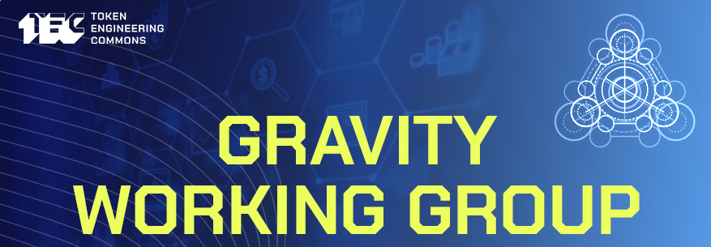

# Gravity DAO Archive

This repository contains an archive of resources related to Gravity DAO (which originated within the Token Engineering Commons).

Previously this repository contained only graviton training study materials, and discord chatlogs.. now all of the Gravity DAO info is being aggregated to this one place.

## Contents

* [**Transcripts from meetings of Gravity DAO**](transcripts/) - Three seasons of Graviton Training, Discord Chatlogs, and some Twitter Spaces
* [**Links to resources related to Gravity DAO**](gravity-resources.md) - Collected from the discord chat.
* [**Youtube Playlists**](youtube.md) - Graviton Trainings, Gravity Working Group, Tec Book Club.
* [**Working Group Documents**](wg-docs/) - Gradually making copies of all gravity docs into markdown.
* [**4 Website Structures**](4-website-structures) - All of the above content broken apart and divided into 4 categories to be used on the new gravity website.

## Main Links

[Website](https://gravitydao.org) - [Dework](https://app.dework.xyz/gravity-dao/) - [twitter](https://twitter.com/GravityDAO) - [Zoom Room](https://us06web.zoom.us/j/87412975245) - [Google Calendar](https://calendar.google.com/calendar/u/1?cid=Z3Jhdml0eWRhb0BnbWFpbC5jb20) - [Graviton Guide](https://docs.google.com/presentation/d/1IfkX70RczxzyX4bjSGabFhOWNF3eLQ1_3LtyMIajXhs) - [Discord Chat](https://discord.gg/5MszcQ739b)

- [Graviton Guide](https://docs.google.com/presentation/d/1IfkX70RczxzyX4bjSGabFhOWNF3eLQ1_3LtyMIajXhs)
  > Gravitons shall be able to:
  > - Make an effort to be present and accessible to the community, bringing high vibes and improving relationships, bringing the community together.
  > - Separate the people from problems. Making parties identify with themselves and the other as equals, rather than centering on their own conflictive thoughts-feelings.
  > - Self-determinate from all parties and recognize key management points by analyzing the information gathered.
  > - Promote empathy between conflicting parties with emotional intelligence. Building proximity from the abstraction of the problem and the humanization of apparent antithesis.
  > - Adapt their mindset for tolerance to conflictive situations, keeping calm and diplomacy to stand as an independent third party.
  > - Propose alternatives to deal with paradoxes while looking for the coexistence and attraction of opposites.
  > - Act according to institutional regulations while implementing actions to frame unwanted behavior within rules and boundaries (Terms & conditions / Codes of conduct / Graduated sanctions)
- [Gravity Working Group Manifesto](https://docs.google.com/document/d/1yrEcPoOW8Q1qDE-YWWF0MhXlcvpiMk0jmdQx25nfZ6k)
  > Gravity Manifesto Explain what is pushing us apart so Gravity can bring us back together. WG lead: Juan Carlos Note! The Working Group Manifesto is a live document, as the working group evolves (e.g. people join the working group) this document should be updated to reflect these changes. This...
- [Permanent Pinned Post - Gravity Channel](https://docs.google.com/document/d/1sJntp5OLoRaChRA77PRsITyAEQK3Nq4u-nGXMancIgk)
  > Gravity Channel in the TEC Server - Regular Update ⚒️ Tasks, Roles, Assignments & Status ⚒️ ➡️ DEWORK Link your wallet to DeWork; Update your user name and organisation https://app.dework.xyz/o/gravity-dao-4UHhckKWxf8whABj2pY8mV/board Apply for tasks if interested (pre-assigned prior) See task st.
- [Gravity Wg Call notes](https://docs.google.com/document/d/19tpH6EU8jYX4FQ0CBtUf0MdsLzjpVo5x7n9W38u9Us4)
- [Conflict Management Typeform](https://the-commons-stack.typeform.com/to/rCVsK5RK)
- [Gitcoin Grant](https://gitcoin.co/grants/3951/gravity-conflict-management-dao) <- Support Gravity Here
- [Gravity DAO on Giveth](https://giveth.io/project/gravity-dao)
  > Gravity DAO is a conflict management commons that is emerging from the cultural build of the Toke
- [🕊 Gravity Working Group](https://forum.tecommons.org/t/gravity-working-group/177)
  > The Gravity Working Group aims to help maintain equilibrium and well-being in decentralized communities through nonviolent communication, transformational approach to conflicts, and a system that provides easy access to management protocols. 
- [TEC Calendar](https://www.notion.so/Calendar-be8a6868a6ef4305b7521fa35a2eb9ba) - Notion 
- [Gravity FAQ Template](https://www.notion.so/Graviton-FAQ-Resources-37309732b1304df59335b6c4ff83aef8)
- [Umbrella Initiative](https://www.notion.so/Umbrella-Initiative-68067593358646dda4498085398ae2c9)
