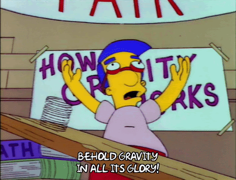

# Session 6: Notes

> Gravitons participation in Community management -> focus in this last two sessions is to understand that the purpose of gravity (and gravitons) is to bring us together.

**Session**
* [Video](https://www.youtube.com/watch?v=qj_XK9zx0Po)

**Season**
* [Slides](https://docs.google.com/presentation/d/15UvsnS9oX5czAKIGHZUqJLhrORpPebWsZeCqmUz9BUE/edit#slide=id.gabe59e4cc3_2_110)

## Contents

- [Links](#links)
- [Value-Aligned Conduct](#value-aligned-conduct)
- [Gravity Code of conduct](#gravity-code-of-conduct)
- [Gravity’s rules & boundaries](#gravitys-rules--boundaries)
- [Protocol for TEC meetings - Common rules for all calls:](#protocol-for-tec-meetings---common-rules-for-all-calls)
- [Gravitons participation in Community management](#gravitons-participation-in-community-management)
- [Guideline for scale of conflicts and graduated sanctions](#guideline-for-scale-of-conflicts-and-graduated-sanctions)
- [Conflict Managment cycle in the TEC (Draft)](#conflict-managment-cycle-in-the-tec-draft)
- [Meditation TIme](#meditation-time)

##  Notes
### Links

- [TEC Code of Conduct](https://docs.google.com/document/d/1S5EoWbsFt3uQ5Wj6yyUJKyApFyjCQ-EloZAr6W55N3U/edit?usp=sharing)
- Gravity Forum Posts
   - [Role design](https://forum.tecommons.org/t/gravity-role-design/174)\
   - [General process](https://forum.tecommons.org/t/gravity-general-process/173)\
   - [Onboarding](https://forum.tecommons.org/t/gravity-onboarding/175)
   - [Protocol for TEC calls](https://forum.tecommons.org/t/protocol-for-tec-calls/186)
   - [Gravity training](https://forum.tecommons.org/t/graviton-training/217)
- Mechanisms to request Gravity conflict management
  - [Typeform](https://the-commons-stack.typeform.com/to/rCVsK5RK)
  - [Calender](https://calendly.com/bell-juan-carlos/15min) availability.
- [Gravity group registry spreadsheet](https://docs.google.com/spreadsheets/d/1HH1lhY4HScQzE1f7cjk89lkoMu3Uw3vmPbFsu97jZa4/edit#gid=0)

### Value-Aligned Conduct

The TEC operates from a *prosocial*, *human centered* perspective:

* **Prosocial** - We value designs that create public goods over profit. Profit is not bad, on the contrary, it is critical towards our goal of creating a regenerative economy that supports the Token Engineering community, but providing services to support the TE community is more important than making a profit.

* **Human centered** - We encourage initiatives that are focused on using token engineering in an ethical manner, and strive to only create positive impact.

#### We hold ourselves to high standards of safety, resilience, and integrity:

* *Safety* - Everyone should feel safe to be, interact and express their opinions and contributions free from any malicious reaction.  
* *Resilience* - We ask members of this community to communicate openly and to make an effort to maintain alignment with the TEC vision, mission and values. If conflicts arise, we expect members to act peacefully towards a resolution and the restoration of harmony and efficiency. If needed,  Loie from the Commons Stack can facilitate a conflict resolution process.
* *Integrity* - Honesty and consistency lead to trust, which is a core value of healthy communities. Our approach is to trust first, and any instances of scam, mislead, spam or defraud will be treated as a violation of this code of conduct. 

#### We encourage our members to be radically open source, non-hierarchical, creative, transparent in their intentions and accountable for their actions

* *Open source* - Ideas are meant to be shared. We default to using GPLv3 and Creative Commons with attribution licensing on our work, but we accept all open source licenses. 
* *Non-hierarchical* - Everyone is encouraged to exercise their autonomy, creativity and full agency when acting in the Commons. Every individual is wise in their own manner and the diversity of perspectives enriches our Commons. 
* *Transparent* - We value individuals' efforts to act transparently, and to proactively identify their incentives, especially if there are conflicts of interest, especially when it comes to proposing, funding, work progress and other important activities involving the TE Commons.
* *Accountable* - Community members are expected to be accountable for all their actions and commitments. Accountability brings trust and trusting in each other is critical for our success. 

#### We are value driven, (not profit driven) and will strive to support token engineering projects that appreciate the value of public goods and ethical, inclusive economic systems.

* *Value Driven* -  we encourage members to support the TE field more so than the opportunity for token values to rise
* *Token Engineering projects* - organized action towards designing sustainable cripto economic systems 
* *Public goods* - subject of collective action problems. Can also be seen as Common Pool Resources

### Gravity Code of conduct

#### What actions can be taken in this medium? 
* Everyone in the community can fill the Gravity [typeform](https://the-commons-stack.typeform.com/to/rCVsK5RK) or approach any of the gravitons to request support for conflicts and any sort of uncomfortable or undesired situations. 
* In case of conflict, Gravitons can approach the parties involved to collect information on the issues. 
* Gravitons can take actions to [regulate unwanted behavior according to the graduated sanctions](https://forum.tecommons.org/t/scale-of-conflicts-graduated-sanction-guideline/234).  
* All community members can propose new methodologies to approach graduated sanctions and mutual monitoring as well as upgrade current ones through Advice Process and Forum Voting. 
* Gravitons can submit conflicts or issues to the Gravity Registry, that is a database of the cases managed by gravity.
* Conflict resolution calls and chats are closed to Gravitons and parties involved to respect privacy and vulnerability. 
* The Gravity working group can host training and capacitate individuals to become Gravitons.
* The Gravity training is free and open for all. 
* Gravity can remove proposals from all the voting categories if they receive flaggins and/or are seen as harmful for the community based on our rules, boundaries, T&C’s and Code of Conduct.   

### Gravity’s rules & boundaries

#### Is this action or outcome required?
- All members should act in acknowledgment of the [guidelines for scale of conflict and graduated sanctions](https://forum.tecommons.org/t/scale-of-conflicts-graduated-sanction-guideline/234)
- Gravitons should comply to the code of conduct of the TEC and the additional [Graviton Code of Conduct](https://forum.tecommons.org/t/gravity-role-design/174) 
- Gravitons should accept cases based on their competence and communicate to the Gravity group if they don’t feel capable of handling an issue. 
- Gravitons should promote trust and good relationships between the community
- It is required to complete the [Gravity Training](https://forum.tecommons.org/t/graviton-training/217) successfully to become a Graviton.
- Gravitons will update the Gravity Registry with the information of possible agreements
- All members should commit to respect the protocol for [TEC calls](https://forum.tecommons.org/t/protocol-for-tec-calls/186)
- Respect the arrangements made about the situations issued

#### Is this action or outcome discouraged? 

- Using the confidential Gravity information to serve personal interest (that leads to expulsion of the Gravity group)
- Violating the requirements for the [Graviton Role](https://forum.tecommons.org/t/gravity-role-design/174) (Any member can monitor Gravitons actions and report to other Gravitons, fill in the typeform, or contact community stewards.

### Protocol for TEC meetings - Common rules for all calls:

- *Nonviolent communication is the common rule* (assertive, careful language)
- *Humbleness of knowledge* (not trying to impose own perspective)
- Respect the *moderation* (The moderator can stop interventions if considered)
- Respect to the *time and topics of the agenda*
- Respect the *others integrity*
- Spamming/sabotage leads to *retire* from call
- Open mics while presentations can be *server muted*
- Participants can use *different languages* for comfortably expressing ideas.

### Gravitons participation in Community management

The TEC has its own tailored rules and boundaries, which are co-created and translated into protocols, processes and guidelines that are made to follow our values, take care of our system and regulate autonomously. 

We are proposing a mutual-monitoring system, where each one of us can inform any issue (through the Gravity Typeform) to a designated group of members in the community, that will assume the following responsibilities:

a) As individuals, to promote dialogue within the organization and manage conflicts addressed through ADR (Alternative Dispute Resolution),\
b) As a collective, to take decisions on the implementation of graduated sanctions.\
c) As both a collective and individuals, to commit to the practice of preventing, contextualizing and resolving disputes by regular attendance in our community practice.

##### Our goal: People in the community recognize the agreements and culturally act coherently with the values of the organization. If there is conflict, there are clear steps to follow in order to manage the situation for the effective search and implementation of solutions that respect the dignity of all parts involved.

#### The Gravity group will aim to support the TEC by:

1. Actively promoting trust, setting expectations, and managing conflict between individuals, the different groups, and the community as a whole.
2. Recognize boundaries and Areas Of Potential Dispute, as well as explicit violations of boundaries between individuals, groups, and the community as a whole.
3. Supporting communication between community members and encouraging participation at all levels. Individually, in groups and inside the community as a whole.
4. Hold admin powers to manage systems of communication (Discord, Telegram, Forum, CV App) on behalf of the individual, the constituent groups and the community as a whole.
5. Promote community resilience and long-lasting human relationships by proactively co-creating boundaries, discussion and exchange in a system of shared values.
6. As a group, take decisions regarding the implementation of graduated sanctions and commit to its participation with respect to all individuals, specially the ones that don’t follow to our terms and conditions.

### Guideline for scale of conflicts and graduated sanctions

#### Framework for studying conflicts and suggest appropriate actions to correct unwanted behavior.
* **Small scale conflicts**: The issue involves few people
* **Mid scale conflicts**: The issue is private but is latent in the community
* **Big scale conflicts**: The issue is public and manifest in the community

#### Suggested actions per management mechanism (graduated sanctions)
##### Self compositives:
* **Negotiation**: The conflict manager (graviton) can act as a witness for an issue that is handled directly between parties.
* **Mediation**: The Graviton acts as a facilitator for the conflict management process, helping to identify key points to reach an agreement, but not directly suggesting a solution.
* **Conciliation**: The conflict manager (Graviton) proposes and helps to implement a suggested solution that should be taken into consideration for approval between parties.

##### Heterocompositive:
* **Arbitrage**: An external point of view is needed to address the issue

More info at: [Scale of conflicts - Graduated sanction Guideline](https://forum.tecommons.org/t/scale-of-conflicts-graduated-sanction-guideline/234) (TECommons Forum)

### Conflict Managment cycle in the TEC (Draft)

### Meditation TIme

