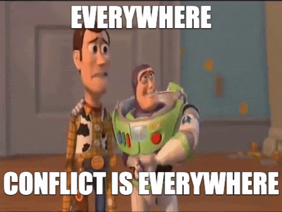
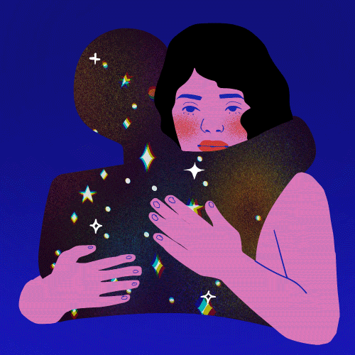

# Session 2: Theories of conflict, Antifragility and Conflict Management

**Session**
* [Video](https://www.youtube.com/watch?v=7L78Gnrtkic)
* [Presentation](https://docs.google.com/presentation/d/15UvsnS9oX5czAKIGHZUqJLhrORpPebWsZeCqmUz9BUE/edit#slide=id.gabe59e4cc3_0_114)

**Season**
* [Forum Post](https://forum.tecommons.org/t/first-graviton-training/217)
* [Slides](https://docs.google.com/presentation/d/15UvsnS9oX5czAKIGHZUqJLhrORpPebWsZeCqmUz9BUE/edit#slide=id.gabe59e4cc3_0_114)

## Contents

**Notes**
* [What is Conflict?](#what-is-conflict)
* [Lederach - Conflict Transformation](#lederach---conflict-transformation)
* [Antifragile, Nassim Nicholas Taleb](#antifragile-nassim-nicholas-taleb)
* [Johan Galtung (Father of Peace Studies)](#johan-galtung-father-of-peace-studies)
* [Francisco A. Muñoz - Qué son los conflictos](#francisco-a-muñoz---qué-son-los-conflictos)
* [John Burton - Conflict Resolution](#john-burton---conflict-resolution)
* [Metamodern Regenaissance](#metamodern-regenaissance)

**Transcript**
- [Theories of Conflict, Antifragility and Conflict management](#theories-of-conflict-antifragility-and-conflict-management)
- [Conflict is... (according to J.P Lederach)](#conflict-is-according-to-jp-lederach)
- [Transformative approach to conflicts](#transformative-approach-to-conflicts)
- [The Dialectic Cycle](#the-dialectic-cycle)
- [J.P. Lederach. Conflict Transformational platform](#jp-lederach-conflict-transformational-platform)
- [Framework for conflict analysis](#framework-for-conflict-analysis)
- [Nicolas Taleb - Antifragility](#nicolas-taleb---antifragility)
  - [Antifragile and conflicts / Breaking points](#antifragile-and-conflicts--breaking-points)
  - [Examples of antifragile](#examples-of-antifragile)
- [Collecting information from world religions ( Galtung’s Transcend Method )](#collecting-information-from-world-religions--galtungs-transcend-method-)
- [J.P. Lederach. Conflict Transformational platform](#jp-lederach-conflict-transformational-platform-1)
  - [Conflict management as a political philosophy](#conflict-management-as-a-political-philosophy)
- [Questions \ Comments](#questions--comments)

## Notes
### What is Conflict?

* [The Orange Story](http://www.mediationtools.com/articles/smbj9605.html) By Lee Jay Berman
  > In our society, we are raised to think that when there is a conflict, one person has to win and the other has to lose. We are not accustomed to working out win-win solutions. It is harder to do. It requires more effort. The outcome, however, is worth it. By working together, cooperatively and collaboratively, we can come up with better solutions, whether in parenting, in employment settings, in business transactions or even in lawsuits.

### Lederach - Conflict Transformation

**1. J. Paul Lederach, [little book of conflict transformation](https://professorbellreadings.files.wordpress.com/2017/10/the-little-books-of-justice-peacebuilding-john-lederach-the-little-book-of-conflict-transformation-good-books-2014-1.pdf)**

> As a starting point, let us explore the differences between the terms look and see. To look is to draw attention or to pay attention to something. In everyday language we often say, “Would you look over here please!” or “Look at that!” In other words, looking requires lenses that draw attention and help us become aware. To see, on the other hand, is to look beyond and deeper. Seeing seeks insight and understanding. In everyday language we say, “Do you see what I mean?” Understanding is the process of creating meaning. Meaning requires that we bring something into sharper focus.
> 
> **Conflict transformation is a way of looking as well as seeing.**
> 
> Conflict transformation is more than a set of specific techniques; it is a way of looking as well as seeing. Looking and seeing both require lenses. So conflict transformation suggests a set of lenses through which we view social conflict.

#### Conflict is... (_according to J.P Lederach_)
* Conflict can be understood as *that which keeps relationships and social structures honest, alive, and dynamically responsive to human needs*, aspirations, and growth.
* Conflict flows from life. Rather than seeing conflict as a threat, we can understand it as providing opportunities to grow and increase our understanding of ourselves, of others, and of our social structures. 
* Conflicts in relationships at all levels are the way life helps us to stop, assess, and take notice. 
* One way to truly know our humanness is to recognize the gift of conflict in our lives. *Without it, life would be a monotonously flat topography of sameness and our relationships would be woefully superficial.* 
* Conflict also creates life: through conflict we respond, innovate, and change.

#### Transformative approach to conflicts
* Conflict is an opportunity, a gift. Conflict is normal in human relationships, and conflict is a motor of change.
* Rather than seeing peace as a static “end-state, ” conflict transformation views peace as a continuously evolving and developing quality of relationship.
* Conflict transformation is to envision and respond to the ebb and flow of social conflict as life-giving opportunities for creating constructive change processes that reduce violence, increase justice in direct interaction and social structures, and respond to real-life problems in human relationships.
* Transformation’s guiding question is this: How do we end something not desired and build something we do desire?

**2. Lederach Summary: [Conflict Transformation](http://peacebuildingforlanguagelearners.pbworks.com/w/file/fetch/73426925/Lederach) By John Paul Lederach , Michelle Maiese**

> *what are useful lenses* that bring varying aspects of conflict complexity into focus and at the same time create a picture of the whole? *This essay will suggest three*.
> 
> **First**, we need a lens to see the immediate situation.
> **Second**, we need a lens to see past the immediate problems and view the deeper relationship patterns that form the context of the conflict. This goes beyond finding a quick solution to the problem at hand, and seeks to address what is happening in human relationships at a deeper level.
> **Third**, we need a lens that helps us envision a framework that holds these together and creates a platform to address the content, the context, and the structure of the relationship. From this platform, parties can begin to find creative responses and solutions. 

**3. (Español) [Resumen del libro de Lederach](https://drive.google.com/file/d/1bY_IQUtQeV76mbuLp4s6sRbrAFDOGVx-/view?usp=sharing)** 

> [Objetivos del cambio en la transformación del conflicto](https://translate.google.com/?sl=auto&tl=en&text=Objetivos%20del%20cambio%20en%20la%20transformaci%C3%B3n%20del%20conflicto%0A%0APersonal%0A%0A-%20Minimizar%20los%20efectos%20destructivos%20del%20conflicto%20social%20y%20maximizar%20el%20potencial%20de%20crecimiento%20y%20bienestar%20de%20las%20personas%20como%20seres%20humanos%20individuales%20en%20el%20terreno%20f%C3%ADsico%2C%20emocional%2C%20intelectual%20y%20espiritual.%20%0A%0ARelacional%0A%0A-%20Minimizar%20la%20comunicaci%C3%B3n%20que%20funciona%20de%20forma%20pobre%20y%20maximizar%20la%20comprensi%C3%B3n.%0A-%20Sacar%20a%20la%20luz%20los%20miedos%20y%20esperanzas%20relacionadas%20con%20las%20emociones%20y%20la%20interdependencia%20de%20las%20relaciones%20y%20trabajarlas.%0A%0AEstructural%0A%0A-%20Entender%20y%20afrontar%20las%20ra%C3%ADces%20de%20las%20causa%20y%20las%20condiciones%20sociales%20que%20provoquen%20la%20aparici%C3%B3n%20de%20expresiones%20violentas%20y%20nocivas%20del%20conflicto.%0A-%20Promueve%20mecanismos%20no-violentos%20que%20reduzcan%20la%20confrontaci%C3%B3n%20y%20que%20minimicen%20y%20en%20%C3%BAltima%20instancia%20eliminen%20la%20violencia.%0A-%20Promover%20el%20desarrollo%20de%20estructuras%20para%20satisfacer%20las%20necesidades%20humanas%20b%C3%A1sicas%20(justicia%20substantiva)%20y%20para%20maximizar%20la%20participaci%C3%B3n%20de%20la%20gente%20en%20las%20decisiones%20que%20afectan%20sus%20vidas%20(justicia%20procesal).%0A%0ACultural%0A%0A-%20Identificar%20y%20entender%20los%20patrones%20culturales%20que%20contribuyen%20a%20la%20aparici%C3%B3n%20de%20las%20expresiones%20violentas%20del%20conflicto.%0A-%20Identificar%20y%20construir%20recursos%20y%20mecanismos%20dentro%20de%20un%20escenario%20cultural%20para%20responder%20constructivamente%20al%20conflicto%20y%20gestionarlo.&op=translate)
> ##### Personal
>   - Minimizar los efectos destructivos del conflicto social y maximizar el potencial de crecimiento y bienestar de las personas como seres humanos individuales en el terreno físico, emocional, intelectual y espiritual.
> ##### Relacional
>   - Minimizar la comunicación que funciona de forma pobre y maximizar la comprensión.
>   - Sacar a la luz los miedos y esperanzas relacionadas con las emociones y la interdependencia de las relaciones y trabajarlas.
> ##### Estructural
>   - Entender y afrontar las raíces de las causa y las condiciones sociales que provoquen la aparición de expresiones violentas y nocivas del conflicto.
>   - Promueve mecanismos no-violentos que reduzcan la confrontación y que minimicen y en última instancia eliminen la violencia.
>   - Promover el desarrollo de estructuras para satisfacer las necesidades humanas básicas (justicia substantiva) y para maximizar la participación de la gente en las decisiones que afectan sus vidas (justicia procesal).
> ##### Cultural
>   - Identificar y entender los patrones culturales que contribuyen a la aparición de las expresiones violentas del conflicto.
>   - Identificar y construir recursos y mecanismos dentro de un escenario cultural para responder constructivamente al conflicto y gestionarlo.

#### J.P. Lederach. Conflict Transformational platform

#### Framework for conflict analysis

### Antifragile, Nassim Nicholas Taleb

> “Some things benefit from shocks; they thrive and grow when exposed to volatility, randomness, disorder, and stressors and love adventure, risk, and uncertainty. Yet, in spite of the ubiquity of the phenomenon, there is no word for the exact opposite of fragile. Let us call it antifragile. 

> Antifragility is beyond resilience or robustness. The resilient resists shocks and stays the same; the antifragile gets better. *This property is behind everything that has changed with time: evolution, culture, ideas, revolutions, political systems, technological innovation, cultural and economic success, corporate survival, good recipes, the rise of cities, cultures, legal systems, equatorial forests, bacterial resistance ... even our own existence as a species on this planet.* And antifragility determines the boundary between what is living and organic (or complex), say, the human body, and what is inert, say, a physical object like the stapler on your desk.”

**5. Taleb, [Antifragile. Things that gain from disorder](https://drive.google.com/file/d/1KiuG5ye52VikNqPPBCvm2D0AxvcJBNrm/view?usp=sharing)**

> The antifragile loves randomness and uncertainty, which also means—crucially—a love of errors, a certain class of errors. Antifragility has a singular property of allowing us to deal with the unknown, to do things without understanding them—and do them well. Let me be more aggressive: we are largely better at doing than we are at thinking, thanks to antifragility. I’d rather be dumb and antifragile than extremely smart and fragile, any time.
> 
> It is easy to see things around us that like a measure of stressors and volatility: economic systems, your body, your nutrition (diabetes and many similar modern ailments seem to be associated with a lack of randomness in feeding and the absence of the stressor of occasional starvation), your psyche. There are even financial contracts that are antifragile: they are explicitly designed to benefit from market volatility.
> 
> Antifragility makes us understand fragility better. Just as we cannot improve health without reducing disease, or increase wealth without first decreasing losses, antifragility and fragility are degrees on a spectrum.

#### Antifragile and conflicts / Breaking points

**6. (Video) [Antifragile](https://www.youtube.com/watch?v=S3REdLZ8Xis)**

> There are things that don't like volatility, and things like volatility, and it's a very, very extremely bipolar view of the world. You almost have nothing in between.
> 
> Effectively, all I did is generalize this idea, to map it to things that option traders-- because option traders, all they do is they drink and they trade options, so they don't have exposure outside of that narrow field. So all I'm doing is representing them to take the idea outside.
> 
> And we can do a lot of things, because effectively, fragility is something I can measure and anti-fragility is something I can measure.
> 
>But risk, you can't really measure--unless, of course, you're at Harvard or Stanford or one of these places where they have the illusion where they can measure risk. But in reality, we can't measure risk. It's something in the future. I can measure fragility.\
> \
> The graph you have here shows you very simply a fragile payoff where nothing happens most of the time. When something happens, it's negative. You see? This is a fragile, and everything fragile has this property.
> 
> To give you a hint, we can generalize it to medicine where you take pills that give you very small benefits. The benefits are small or nonexistent, and the harm is large and rare and often not seen in the past history of the product. That's a fragile.
> 
> I take a pill, it gives me small benefits, and then 10 years later, you realize that it gave you cancer or some hidden disease that nobody saw. It's the same payoff for fragile.\
>
> The robust will have this payoff--it doesn't care--and the anti-fragile will have this payoff where harm is small and the big variations are positive, are favorable.
So this is sort of like the idea or the general idea.

#### Examples of Antifragile

> “So we tend to over-technologize and underestimate the might of the equivalent of these small wheels on suitcases that will be staring at us for the next millennia.”

### Johan Galtung (Father of Peace Studies)
**7. [Conflict management and peacebuilding in everyday life](https://www.reddbarna.no/Media/dokumenter/ResourceKit-web.pdf)**

> We recognise that there are some similarities and overlaps between the concepts of conflict and violence as both conflict and violence can cause damage and harm. However, there are also some important differences. One of the most important differences is that while VIOLENCE is always negative and harmful, CONFLICT can sometimes be positive, if we respond to it in a constructive way.
> 
> Here is an example of positive outcomes associated with conflict described by children and young people in Asia: Through conflicts we can sometimes learn from our mistakes... conflict can encourage new thinking patterns and positive change.... the conflict response can lead to more justice.

**8. Galtung, [Conflict transformation by peaceful means](https://www.transcend.org/pctrcluj2004/TRANSCEND_manual.pdf)**

#### Collecting information from world religions ( Galtung’s Transcend Method )

- *following Hindu thought*, remember: Conflict the Destroyer and Conflict the Creator; conflict as a source of violence and conflict as a source of development. The conflict worker has the third role as Preserver, transforming the conflict by avoiding violence, promoting development.
- *following Buddhist thought*, remember: Codependent origination, everything grows together in mutual causation. Conflicts have no beginning and no end, we all share the responsibility; no single actor (like statesmen) carries all the responsibility (monopoly) and no single actor carries all the guilt.
- *following Christian thought*, remember: Ultimately, the responsibility for conflict transformation lies with individuals and their individual responsibility and decisions to act so as to promote peace rather than violence, and the principle of hope.
- *following Daoist thought*, remember: Everything is yin and yang, good and bad, there is the high likelihood that the action chosen also has negative consequences and that action not chosen may have positive consequences; hence the need for reversibility, only doing what can be undone.
- *following Islamic thought*, remember: The strength deriving from submitting together to a common goal, including the concrete responsibility for the wellbeing of all.
- *following Judaic thought*, remember: The truth lies less in a verbal formula than in the dialogue to arrive at the formula, and that dialogue has no beginning and no end.

#### Conflict management as a political philosophy

* **Conflict itself is not bad**. It is an expression of the diversity of interests, ideas and points of view. It arises in all human relationships and, like crises, can be excellent opportunities to grow, emerge stronger, learn and improve.
* When assuming conflicts are negative, people and institutions tend to fear them and adopt one of these two attitudes: 
  1) they resort to force, power or violence to crush them; or
  2) they ignore them hoping they will pass without addressing them.
* When a conflict arises, both parties may believe they have the only logical stance, since each sees the situation exclusively from their particular point of view. Hence the need and importance of dialogue, as a mechanism that allows the search for collectively constructed solutions through listening and incorporating the other’s perspective.
* **The quality of an institution is not determined by whether or not it has conflicts, but by how it manages to address them**.

* [PeacePower: Johan Galtung's Transcend Approach: Confederation in Iraq and a Middle East Community for Israel/Palestine](http://calpeacepower.org/0201/galtung_transcend.htm)
  > Transcend believes that all conflicts are born equal and have the same right to transformation; no conflict is "higher level" than another. Whether the solution lies in a shared national park or the creation of a community of six states, this philosophy ensures that each conflict is addressed by Transcend in the same, principled, peaceful and creative way. Galtung's visions for the peaceful solution of these current violent Middle Eastern conflicts represent peaceful, realistic and therefore compelling alternatives.     

### Francisco A. Muñoz - Qué son los conflictos

**9. (Español) [Qué son los conflictos](https://drive.google.com/file/d/1ovWrJw3w6t-opZQyB_fys71WbZnZ7we4/view?usp=sharing)** - Francisco A. Muñoz

> Hay un aspecto inicial que nos gustaría abordar. Si, como hemos visto en el apartado anterior, las personas y los grupos humanos estamos afrontando cotidianamente situaciones de conflictividad, que abordamos en la mayoría de los casos sin apenas esfuerzo y sin ser conscientes de ello, es decir si estamos continuamente regulando conflictos que colaboran a nuestro bienestar, no podemos ahora olvidarnos de ellos, hacer como si no existieran. 
> 
> [Una preocupación seria debe ser estudiarlos lo más rigurosamente posible para disponer de mayores recursos para la paz.](https://translate.google.com/?sl=auto&tl=en&text=Hay%20un%20aspecto%20inicial%20que%20nos%20gustar%C3%ADa%20abordar.%20Si%2C%20como%20hemos%20visto%20en%20el%20apartado%20anterior%2C%20las%20personas%20y%20los%20grupos%20humanos%20estamos%20afrontando%20cotidianamente%20situaciones%20de%20conflictividad%2C%20que%20abordamos%20en%20la%20mayor%C3%ADa%20de%20los%20casos%20sin%20apenas%20esfuerzo%20y%20sin%20ser%20conscientes%20de%20ello%2C%20es%20decir%20si%20estamos%20continuamente%20regulando%20conflictos%20que%20colaboran%20a%20nuestro%20bienestar%2C%20no%20podemos%20ahora%20olvidarnos%20de%20ellos%2C%20hacer%20como%20si%20no%20existieran.%20%0A%0AUna%20preocupaci%C3%B3n%20seria%20debe%20ser%20estudiarlos%20lo%20m%C3%A1s%20rigurosamente%20posible%20para%20disponer%20de%20mayores%20recursos%20para%20la%20paz.%0A&op=translate) 

### John Burton - Conflict Resolution

**10. [Burton, Conflict resolution: Towards problem solving](https://core.ac.uk/download/pdf/51092982.pdf)** 

> Societies remain power-elite dominated. The diversion of resources to provide education and other services on an equitable basis is being increasingly resisted. Funds are being cut. There is a retreat to specialization, and a holistic approach to problems is politically unpopular. But if civilizations are to survive the contemporary trend towards increased crime and violence at all social levels has to be dealt with by means which eliminate it, rather than merely contain it within less privileged regions. Civilizations must, if they are to survive, move from power-elite politics to problem-solving. It is the responsibilities of universities in particular to bring these issues to attention, and to give students in all disciplines the opportunity to question, to explore and to innovate. This new a-disciplinary study, Conflict Resolution, provides an opportunity

### Metamodern Regenaissance

(shared, by @durgadas, in chat as related)

* [The Regenaissance - A Metamodern Playbook](https://docs.google.com/document/d/1toqpJ8IcOnc-TeP_-AnGNEKz5jTIZk6OeWj2XD1REuE/edit)
 > The Regenaissance is the potential cultural era from 2020 to 2030 where the seeds of planetary regeneration were sown, and the harvest begun.
 > 
 > The Regenaissance is born, like the Renaissance, from an information explosion.
 > 
 > In a few centuries the development of macro and micro-optics transfigurated the medieval cosmos, the rediscovery of ancient Greco-Latin code pried open the Christian hegemony, and the invention of the printing press sparked an explosion of cultural creation.
 > 
 > But the Regenaissance must manifest in a single decade.
 > 
 > We stand before the transportal of AI, gene editing and the Anthropocene. How we yield this triforce over the next decade will determine all life to come.
* [Metamodernism: The Basics](https://web.archive.org/web/20210114093419/https://www.huffpost.com/entry/metamodernism-the-basics_b_5973184)
 > Metamodernism seeks to collapse distances, especially the distance between things that seem to be opposites, to recreate a sense of wholeness that allows us to — in the lay sense — transcend our environment and move forward with the aim of creating positive change in our communities and the world. 
* [What Is Metamodernism?](https://www.huffpost.com/entry/what-is-metamodernism_b_586e7075e4b0a5e600a788cd)
 > Sometimes the sort of understanding metamodernism offers us is a logical understanding of how and why things happen during this particular period in human history. In this sense, we can see metamodernism as a  “system of logic” that helps us better navigate the digital age. 
 > 
 > At other times, metamodernism helps us understand our emotional reactions to things that are happening now—both our reaction as individuals, and the reactions of whole communities and even nations—at which point we can see metamodernism as a “structure of feeling.” 
 >
 > In short, cultural philosophies help us make sense of our times by seeing patterns in how entire cultures (and individual subcultures within those cultures) operate. And because American culture, like any culture, has political and economic subcultures as well as ones in which new art is regularly being made, metamodernism gives us a lens through which to consider nearly everything that’s happened in America [and the rest of the world] since the invention of the internet: political, socioeconomic, and sociocultural.
* [The Listening Society: A Metamodern Guide to Politics, Book One (Metamodern Guides 1)](https://www.amazon.com/Listening-Society-Metamodern-Politics-Guides-ebook/dp/B074MKQ4LR/) - [Book Review](https://medium.com/the-abs-tract-organization/the-listening-society-ed10f559f824)

> “There are three different parts of political metamodernism:
> * **The Listening Society** — which is the welfare of the future, a welfare that includes the emotional needs and supports the psychological growth of all citizens. A society in which everyone is seen and heard (rather than manipulated and subjected to surveillance, which are the degenerate siblings of being seen and heard).
> * **Co-Development** — which is a kind of political thinking that works across parties, works to keep ego-issues and emotional investments and biased opinions in check, and seeks to improve the general climate of political discourse: “I develop if you develop. Even if we don’t agree, we come closer to the truth if we create better dialogues and raise the standards for how we treat one another.”
> * **The Nordic Ideology** — this is my name for the political structure that would support the long-term creation of the listening society and make room for co-development. It is called the Nordic ideology because its early sprouts are cropping up in and around Scandinavia. It includes a vision of six new forms of politics, all of which work together to profoundly recreate society. A large part of this has to do with how to defend citizens from new sources of oppression that can emerge as a side-effect of a “deeper” society. These new forms of oppression are generally of a more subtle and more psychological kind than what we have seen in the 20th century.”

### Questions

1. What is a conflict transformation platform according to J. P. Lederach?
2. What are the key points of the transcend method as proposed by J. Galtung?
3. What is the property of antifragility according to N. Taleb

## Transcript

(00:00:01)
**Juan Carlos**:    Hello to everyone that is joining well. This is the second session of the graviton training. In the first session we were talking with Regis Chapman and for this session, the facilitator would be me and I am going to talk a bit about **theories of conflict and fragility and conflict management**. 

I am going to start telling a bit about myself. I studied two years of philosophy and then I moved to political sciences and then I started specialization in sustainable development, then in environmental law. Then I study a Masters in conflict management. 

I am very passionate of studying conflict and I have found it to be something that can be applied in our everyday life and in our organizations. 

That is why I am proposing to train people in these skills of managing conflict for promoting the wellbeing of organizations, the slide you can watch them, they are in the TC general. 

I would like to tell you that everything that I will be talking about in this session, I want you to frame it to a conflict or a situation that you have had in your life that you can associate to the things that we are going to talk about and conflict that you have had in your life. 

Maybe when you had that conflict, it seemed something really big and something that wasn't going to solve. Now, you can see that conflict as a gift, as an opportunity that taught you something as an and as an opportunity for you to grow. 

### Theories of Conflict, Antifragility and Conflict management

These are the readings that we are going to cover in this session.  

**1. J. Paul Lederach, [little book of conflict transformation](https://professorbellreadings.files.wordpress.com/2017/10/the-little-books-of-justice-peacebuilding-john-lederach-the-little-book-of-conflict-transformation-good-books-2014-1.pdf)**
**2. Lederach Summary: [Conflict Transformation](http://peacebuildingforlanguagelearners.pbworks.com/w/file/fetch/73426925/Lederach) By John Paul Lederach , Michelle Maiese**
**3. (Español) [Resumen del libro de Lederach](https://drive.google.com/file/d/1bY_IQUtQeV76mbuLp4s6sRbrAFDOGVx-/view?usp=sharing)** 
**4. Taleb, [Antifragile. Things that gain from disorder](https://drive.google.com/file/d/1KiuG5ye52VikNqPPBCvm2D0AxvcJBNrm/view?usp=sharing)**
**5. (Video) [Antifragile](https://www.youtube.com/watch?v=S3REdLZ8Xis)**
**6. [Conflict management and peacebuilding in everyday life](https://www.reddbarna.no/Media/dokumenter/ResourceKit-web.pdf)**
**7. Galtung, [Conflict transformation by peaceful means](https://www.transcend.org/pctrcluj2004/TRANSCEND_manual.pdf)**
**8. (Español) [Qué son los conflictos](https://drive.google.com/file/d/1ovWrJw3w6t-opZQyB_fys71WbZnZ7we4/view?usp=sharing)** - Francisco A. Muñoz
**9. [Burton, Conflict resolution: Towards problem solving](https://core.ac.uk/DAOnload/pdf/51092982.pdf)** 

(00:03:09)
**Juan Carlos**:    **I can divide this into three main sections** the first one is about *conflict transformation* called according to Jean Paul Lederach. The second part of the talk relates to *antifragility* and the third part of the talk is about method of *transformation by peaceful means*

I want all of you to think about the conflict that you have had in your life, that, to which you can apply some of methods and ideas that I'm going to explain so that after this session, you can see conflict as a gift that life gave you, and as an opportunity to grow, something that you can be thankful for. 

We are going to talk about conflict as a motor of change. 

First we, I am going to start with this question, what is conflict?  

[MediationTools.com - Article: "The Orange Story"](http://www.mediationtools.com/articles/smbj9605.html)

**Deeper questions:**
- What do they want?
- What are their needs?
- What are their interests?

(00:04:29)
**Juan Carlos**:    I would like to present this first image that refers to a really basic source of conflict. This conflict is when we are in our own own points of view. We are not able to understand the other points of view. Sometimes reality is not one or another point of view. It's just a composition of both of them. 

A conflict is when two or more people like try to enforce a of reality that they think that is the whole truth. But what we are trying to talk about conflict is that this reveals us that there are no final truths and that we are all a addressing and connection of subjective points to that composes our reality. 

What is seen in a conflict is that participants push for their point of view, and what is not seen is why do they want the opinion to be heard? For conflict resolution, more than a final truth, **we need to understand the reasons why each one is attached to their position**. 

This is a very easy example of how communication can take us to a good agreement. There were two sisters fighting for an orange, and then the mom decided to split the orange in half, and she gave half of the orange to each one, but then she saw that one was squeezing the orange to make some juice. 

The other one just peeled some of the skin of the orange to bake a cake then threw the rest into the garbage. Conflict resolution is to understand ways of how can we take a better decision for both of the parties involved through communication. 

In the orange example, if the mom would have talked with their daughters she could have like given the fruit to one and the skin to the other, and everyone would be happy, but sometimes we just use these kind of prisoner dilemmas where, where they are fixed and they model our reality.  

> Sometimes we need to think out of the box and to see how communication can create opportunities that are not present in the first moment. 

For conflict resolution, we need to ask ourselves deeper questions. When we see a conflict is what do each of the participants and of the parties want in the conflict? What are their needs and what are their interests, maybe in this case to see nine benefits, more this person, and to see six benefits for this person. 

If they they talk, they can even benefit to say it's neither six or nine, or maybe if he talks with him, they can both say it's six. It's not a fixed situation, but through a dialogue you can come to a better state than the one that you started.  

(00:08:48)

I don't want to scare you, but this is something that I am here to present that **conflict is everywhere**. When you study conflict, it's not that you are not gonna have any conflict in your life that are gonna be perfect. 

It's just that you are gonna be able to embrace, change and embrace conflict as something that is natural in life and embrace that things are not going to always happen as you want. that is an opportunity for you to understand, to improve, to learn, to become better, to innovate. 

Conflict is everywhere, but it's not like I'm gonna have a conflict just because, but we have to see conflict rather as a force, as a motor of change. As a dialectic process. 

[Why is Gravity Relevant in Token Engineering](https://medium.com/token-engineering-commons/why-is-gravity-relevant-in-token-engineering-e28ae4a5b5a1) Token Engineering Commons

(00:10:10)
**Juan Carlos**:    OK. Yeah. We need to embrace conflict, embrace ourselves, embrace change, and treat ourselves with love and to talk to ourselves without judgment and applying what we learned from the first session that is to have nonviolent communication with others and with ourselves to embrace change and to embrace that nothing is going to be as we think in our minds. 

Reality is so much complex that we should also embrace the other and have empathy for what the other feels and why do the other person stands for their point of view.  

### Conflict is... (according to J.P Lederach)

* Conflict can be understood as **that which keeps relationships and social structures honest, alive, and dynamically responsive** to human needs, aspirations, and growth.
* Conflict flows from life. Rather than seeing conflict as a threat, we can understand it as providing opportunities to grow and increase our understanding of ourselves, of others, and of our social structures. 
* Conflicts in relationships at all levels are the way life helps us to stop, assess, and take notice. 
* One way to truly know our humanness is to recognize the gift of conflict in our lives. **Without it, life would be a monotonously flat topography of sameness and our relationships would be woefully superficial.** 
* Conflict also creates life: through conflict we respond, innovate, and change. 

Now we are going to start with the first reading that is from Jean Paul Lederach, that I really like. He said that **conflict is what keeps relationships and social structures, wholeness, alive, and dynamically responsive to human needs.** 

I mean, yes, I love this definition because we can see conflict as the price for change. That always non-linear thinking when sometimes we have a linear thinking and we think that our ideas are going to be the ultimate truth, but we have to see truth as a continuous evolution of a dialectic process. 

If we wouldn't have conflict, like our life would be monotonous would be flat, or everything would be the same and our relationships would be superficial. It would be a monologue. I am going to start here talking about the difference between a monologue and a dialogue.  

A dialogue is when you incorporate the other person and put in the other person's shoes and a monologue is when only you talk. Conflict is an expression of diversity. Conflict is an expression of the other conflict is an expression of the points of view that you are not seeing, and is also a gift for you to broaden and to improve and to incorporate others, to fulfill our needs and to evolve. Conflict flows from that. 

The idea of graviton and this training is for the people that is hearing this to not see conflict as a threat, but to see something as that provides opportunities to grow and increase our understanding of ourself and our social structures. If we have conflict in our relationships, that is a way that life helps us to stop, assess and take notice.  

We are using a transformative definition of conflict. Sometimes we think conflict as something bad or we relate conflict with violence, but violence is a response to conflict that is not led by dialogue. Instead, if we treat conflict with dialogue, we can promote peace. 

It's like changing our mindset of how we respond to conflict. if we respond to conflict with violence, we are inhibiting the change process the conflict has within. Instead of reacting with violence, when we have a conflict, we have to under to think, what is this conflict teaching me? Why I, am I having this conflict? Why, what, what can I learn from this conflict to be better in the future?  

### Transformative approach to conflicts
* Conflict is an opportunity, a gift. Conflict is normal in human relationships, and conflict is a motor of change.
* Rather than seeing peace as a static “end-state, ” conflict transformation views peace as a continuously evolving and developing quality of relationship.
* Conflict transformation is to envision and respond to the ebb and flow of social conflict as life-giving opportunities for creating constructive change processes that reduce violence, increase justice in direct interaction and social structures, and respond to real-life problems in human relationships.
* Transformation’s guiding question is this: How do we end something not desired and build something we do desire?

(00:14:50)

Continuing this transformative approach of conflict, I am saying that conflict is a gift from life. Conflict is human is normal in human relationships. It is, we have conflict within ourselves, within the others. We have conflict with our institutions. 

We have conflicts with our communities, and sometimes even conflicts happen without intention. Maybe you have the best intention to do something, and then you like forgot and a conflict arose, but you have to respond to that and you have to see it as something that needs a response. 

That is why it is and can be seen as a dialectic process. Rather than seeing peace as an end state and static idea, conflict transformation, piece abuse, peace as a continuously evolving and developing quality of relationships. 

Peace is not like we have peace and we're not gonna have any conflicts anymore. Peace is rather through the evolution of our relationships are able to address our own conflict. That we are not like if we have conflict, then we need the other person, or we try to impose our point of view, but seeing peace as the ability to manage conflicts as something proactive and good for the whole.  

I love these transformations guiding question, and you can ask our ourself, when you have a conflict, you can ask yourself this, and this can change instantly your mindset on the conflict. How do we end something not desired, build something we do desire. 

That is a stopping point. When you're in the middle of a conflict, you ask yourself this question, and you can, and you say, okay, if I continue with this path, I am going to have the same responses. I have to change my behavior. I have to change how am I seeing the conflict? 

I have to understand the other person to build something we desire because of that conflict transformation is like a way to respond to the flow of social conflict. and to create something about, about from this apparent, apparent opposite, and to create something from apparent prop opposites for the better, and that can help us to improve our social structures and to respond to real life problems.  

### The Dialectic Cycle

(00:17:55)

I've been talking about dialectics and about the dialectic cycle and the difference between a monologue and a dialectic cycle is if a monologue, then the thesis is the same each point of the spiral, but here, and this is related to what we saw in the first session of a spiral dynamic. 

Here, we can see development as spiral, but this is something that has pieces and thesis and synthesis is because of the incorporation of the antithesis that you can have synthesis is not an end state of truth. That synthesis always have anthesis. 

That always, that also leads us. That is the process of what, what, how can we see the conflict contr our, our dialogue. This is I'm Hager, but here we can also see how mark about this dialectic cycle in his theory of dial dialectical materialism, that is the, like the division of classes.  

The fight between classes is what leads us to evolution in our institutions. This conflict between classes is what is taking us to another place. I still feel that we are in the era of capitalism because we are, we have this fight of classes between the work, you see the very rich people and the people that is not in this position of economic profit of advantage from the economic system. 

I think that in, because of this conflict that we are having right now, we are also having new and alternative ways of seeing social structures as dos and as all the decentralized world that I can see as a response to the conflict between that we have in our economic system, between rich people and poor people.  

I would really like go deeper into mark, but this is not like the purpose of this topic of this, of this session, but he states the difference between the value of use and the value of exchange. I think that we are still stuck in, in that division where we give value to what can be exchanged and not give value to what we can use or what we need. 

It's like a change of paradigm that we are, that we are still, and even to under, to reflect on how do we measure human labor, because we are measuring human labor, according to what is productive to the economic system. We are not giving the value to human just for the essence of living, being part of a society and being part of this world.  

I think this is something that is amazing. and to live in this moment, because this whole boom of UBIs and this Bo boom of the centralized economies and of dos is something that is also looking to change that the way we distribute the resources in our, in our economy, and also the way how we value humans. 

I feel more valued in this community, in this decentralized community of the TC that I feel in my own country. For me, this is a very good way to avoid some of the, of the, of the conflicts that we have right now with our institutions and with our government.  

### J.P. Lederach. Conflict Transformational platform

(00:22:53)
Now I want to go back to Lederach and what he calls a transformational platform. If we see that evolution comes from an, an spiral process and an, a dialectic process from this is from thesis and thesis and synthesis, we can see this transformational platform as something that promotes and accept the inputs from the system to deliver answers that are dynamic and that dynamized and speed up the change process instead of slowing it. 

Instead of having like institutions that they just want to prevail and prevail over time, we could have institutions that than more than prevailing over time, they just want to improve, and they accept their own weakness to see how can they improve. 

A transformational platform, according to Lederach is short time responses and long term strategic is strategic. Because if you can conflict in a short period in a short term, then you can address conflict in a longer term. That gives you resilience. 

It short term responses, because it can process the conflicts that we are having this moment to catalyze the change and the learn, and the learnings that is within that conflict. That transformational platform has the capacity to generate and regenerate change processes from the immediate episodes and the relational context. 

I think that this is the way that we should build our institutions, and this is a way that we should build our dos so that they, they can respond to the, to the, to the things that happen and that they can innovate and that they can learn from their own mistakes.  

### Framework for conflict analysis

(00:25:16)

We are talking about this is spiral process that has to move to evolve, but how can we like catalyze conflict into something good? And I am proposing this framework for conflict analysis that is based on the three piece, but here are four piece and relating it to the process of nonniolent communication. 

When conflict arises, you have to start an observation process to see who are the actors, what is their relationship of power? What is their interest? You have to observe the problem without judgment, like without having any personal interest, you have to see the conflict as if as an exterior, as an even within yourself. 

Then you can understand the feelings and understand the intention of, of why the problem arose. For that, need to understand the context, the arguments of that are faced the aspirations that is big behind each argument, and try to measure the scale and the reach of the conflict so that you can like also understand that when a conflict is too big, there's no management Mar margin.  

Sometimes you just need to give time to the conflict or wait for the conflict to like calm DAOn a bit so that you can act with it. You have to have recognition from both parts of the conflict and willingness to solve that. If we have these two steps, then we can go to the process of identifying needs from the conflict. 

Identifying what were the triggering events, what are the ways of fighting and what would be the best ways to address this conflict? What has been the management given and how can we improve that management? How has been the communication between the parts and how has the conflict been evolving over time? 

Then, we can identify the needs in order to propose possible solutions that can be seen as formulating requests.  

To propose possible solutions, we need to compare with reference and signals, because sometimes we think that a conflict is the first time that is happening. But as conflict is something that has been with humans through all history, it's very difficult. 

That is a conflict that anyone has had. Our conflicts can have reference and signals and we can learn from other mistakes and learn from other ways of handling their issues. To put in practice debt and we to keep looking for solutions, we need to explore alternatives testing for the legitimacy of the agreements. 

Sometimes we can propose a solution that it's not legitimate. In order to propose solution, this is a very careful process where you need to understand the needs and the feelings to be able to propose a situation that can be better from the initial situation. 

We need to do a lot of planning and foresee reactions so that the things that happen don't, don't have a surprise, and also having follow up mechanisms to have like that the solution is being implemented. 

We can have a cycle to address a conflict and transform that conflict into something constructive rather than something destructive.  

With that, I finish this first section of the talk. If you have any question or comments, I would be happy to open mic. After, before jumping into the next section.

### Nicolas Taleb - Antifragility

> “Some things benefit from shocks; they thrive and grow when exposed to volatility, randomness, disorder, and stressors and love adventure, risk, and uncertainty. Yet, in spite of the ubiquity of the phenomenon, there is no word for the exact opposite of fragile. Let us call it antifragile. 
> 
> Antifragility is beyond resilience or robustness. The resilient resists shocks and stays the same; the antifragile gets better. **This property is behind everything that has changed with time: evolution, culture, ideas, revolutions, political systems, technological innovation, cultural and economic success, corporate survival, good recipes, the rise of cities, cultures, legal systems, equatorial forests, bacterial resistance ... even our own existence as a species on this planet.** And antifragility determines the boundary between what is living and organic (or complex), say, the human body, and what is inert, say, a physical object like the stapler on your desk.”

(00:30:29)
The property of antifragility is behind everything that has changed with time, evolution, culture, ideas, revolutions, political systems, technological innovation, cultural, and economic success, corporate survival, good recipes, the rise of cities, cultures, legal systems, equatorial, forest, bacteria, resistance, even our own systems of species on this planet. 

**What is antifragility?** Anti fragility is the capacity to learn from things is the capacity and its different. It's different from resilience and robustness because when things are resilient, they receive a shock and then they can receive it again, and then they can receive it again so that they become so strong that they can have this shock so many times, but they don't change.  

They just like are strong enough to receive the, the wanted behavior so many times, but they don't change. But the difference with anti fragility is that instead of being able to receive the same shock for so many times, we learn from that shop and then we are able to avoid it or to take another decision or to not step into that same stone. 

The difference between resilience and anti fragility and robustness is that robustness can receive shocks, tt doesn't change. Resilience is the same that like, it can receive a lot of shocks and stay the same, but antifragility, antifragile is things that when they receive a shock and then they improve, or can avoid having the same shock.  

That property of antifragility is something that we all have as humans. That we also all should try to put in practice in our everyday life. The best way to verify that you are alive is by checking, if you like variations, food would not have taste. 

If it weren't for hunger, results are meaningless. Without effort, joy cannot exist without sadness. Conviction cannot exist without uncertainty. We should embrace the difference and see it as a gift and something that can help us to improve and to become more anti RA, rather than seeing difference as something that can destroy us. 

Because if we see conflict as something that can destroy us, we are being fragile. We are being fragile, or, and we are being resilient if we are having the same problem over and over again, and we are just letting it pass, but we need to be anti as like, if we had a conflict, then we are not going to have that conflict again, we're just gonna improve.  

#### Antifragile and conflicts / Breaking points

(00:34:26)

This is a graph of how antifragility works. I really like it because I want to have an example on this. The idea of immutability in blockchains is a really good idea. But then when you, but then it always comes a breaking point. 

If there were an attack, like what is more important? to keep having the same inability and to not change it, or something that if it changes, then it would become antifragile. I think that this is one of the biggest leaps that had the blockchain ecosystem where they decided to put more importance on the economic consent than the immutability because they innovated.  

That innovation is what is leading to some of the frontier innovations in blockchain. If we would have stayed the same with inability. We change to value this idea of economic consent to be above immutability and that idea is leading us right now to have layer two implementations and roll-up that comes from this innovative idea of economic rather than just immutability. 

Is a really good example because, because immutability is an idea that when it breaks, then you cannot have it again. It's a very fixed idea, but so it's not anti-fragile but to have economic consent is something that we can resist shocks and innovate from them. We had a conflict, we learned from that conflict and that is not going to happen to us again.  

We can see the benefits of having that problem. That now we also care for the cultural build in DAOs and not just like to have a technological organization, that can be like a perfect machine, but it's not friendly to human. 

What we are doing with this cultural builds with this, what I am trying to do with conflict resolution is to help all the ecosystem, to keep themselves in innovating and understanding and learning from past events so that we can use what was wrong in the past to improve in the, in the future. 

#### Examples of antifragile

> “So we tend to over-technologize and underestimate the might of the equivalent of these small wheels on suitcases that will be staring at us for the next millennia.”

This is a really good example of antifragile because we sometimes tend to over technologize and underestimate the might of the key of these small wheels and suitcases that will be staring us from the, for the next mile.  

(00:38:16)
You can see that the pots and pans from Pompeii are hardly different from the ones found in today's good kitchen anti-fragile things are things that can stay the same and improve over time. Sometimes when we think on the future, we forget about the things that has been with human life and our human essence and our societies from the start to the end. 

We cannot plan our future without cooking utensils. We should think of our ideas to be indispensable we should think of our ideas as something that can improve with time as something that can resist shocks as something that when in a thousand years that people can still replicate and learn from them and improve them.  

One of the things that I really like about this theory of anti-fragile is, and the way we can see a lot of knowledge in ideas that has, that have been produced and replicated over time, we can also gather information from things that are really old, like world religions. 

### Collecting information from world religions ( Galtung’s Transcend Method )

> following Hindu thought, remember: Conflict the Destroyer and Conflict the Creator; conflict as a source of violence and conflict as a source of development. The conflict worker has the third role as Preserver, transforming the conflict by avoiding violence, promoting development.
> following Buddhist thought, remember: Codependent origination, everything grows together in mutual causation. Conflicts have no beginning and no end, we all share the responsibility; no single actor (like statesmen) carries all the responsibility (monopoly) and no single actor carries all the guilt.
> following Christian thought, remember: Ultimately, the responsibility for conflict transformation lies with individuals and their individual responsibility and decisions to act so as to promote peace rather than violence, and the principle of hope.
> following Daoist thought, remember: Everything is yin and yang, good and bad, there is the high likelihood that the action chosen also has negative consequences and that action not chosen may have positive consequences; hence the need for reversibility, only doing what can be undone.
> following Islamic thought, remember: The strength deriving from submitting together to a common goal, including the concrete responsibility for the wellbeing of all.
> following Judaic thought, remember: The truth lies less in a verbal formula than in the dialogue to arrive at the formula, and that dialogue has no beginning and no end.

This is something that Johan Galtung uses for what he calls the transcend method. If we can see truth in a lot of things that have, that have been addressed in humanity. We can see that conflict management is antifragile because it has been addressed by a lot of the world religions. Each religion has its point of view to address conflicts and their concern of about managing conflicts, refer to us that this is something that we are going keep having.  

Even though some of the, of the religions fight over who has the truth, I really like the position that Durgadas explains. Sometimes that you can see mythology as something that can be used to express really complex ideas in a really simple language. Even though we can have like religious fights over what is the final truth, we can also build a certain way of thinking that by gathering different ideas from the religions. 

In the Hindu thought, you see, you can see conflict that is the destroyer and conflict is the creator. Conflict is a source of violent and conflict as a source of development, the conflict worker, as the third role as transforming and conflict by avoiding violence and promoting development. 

Well, the conflict worker is something that has been like one of the first ways to address conflict in, in human life.  

In the future, we are gonna still need conflict workers, even though we have a super automatized future. I'm really hard to believe that our conflicts can be solved by a machine. I think that this is something very human and that this is something that has, that has to be very human and that the conflict workers are going are like these small wheels that we have had through hu through human history and that we can still have in the future, because they sometimes, somehow they manage to work.  

In the beauty thought, it says that everything grows together in mutual causation conflicts has no beginning and no end. We all share the responsibility. No single actor carries the responsibility and no single carries all the guilt. This is something that we are also working on here in the TC by having mutual accountability, because we, we all are carrying the responsibility of the wellbeing of the community. 

As graviton, this is a very big role that we should, that we should have in the com in our different communities and having the following. The Christian thought the responsibility for conflict transformation lies with individual and in their individual responsibility and decisions. 

To act so that they promote peace, rather than in the dais thought, we can say everything is ding and yang, good and bad. There is high likelihood that the action chosen also has negative consequences.  

That action not chosen may have positive consequences, hence the need for reversibility only doing what can be undone this in Islamic, the strength deriving from submitting together to a common goal, including the concrete responsibility of the wellbeing of all. I really like this last one that is the truth lies less in a verbal formula than in the dialogue to arrive at the formula. That dialogue has no, and has no end this dialogue and to arrive at the formula. 

It is something that I can relate a lot to this because it's something that we, we can see as conflict management, not as conflict, not as solving just one conflict, but as, as a way to understand conflict in our lives to produce something change and to produce something better. It's not to arrive in a thesis because all thesis are gonna have Ansis is to be able to synthesize the, and to have empathy for the other points of view.  

### J.P. Lederach. Conflict Transformational platform

(00:45:42)
**Juan Carlos**:    so that we are not a monologue in our heads. and reality is our expression of our thinking. But to see this reality as a dialogue and as a process, that constantly is evolving from the interaction with the other person. With this, I want to go with the final section in this of this section of this talk, and is that conflict management can also be seen as a political philosophy because conflict is itself is not bad. It is an expression of the diversity of interest ideas, and points of view. It arises in all human relationships, like crisis can be excellent opportunities to grow, emerge, stronger, learn, and improve. That when assuming that conflicts are negative people and institutions tend to fear them and adopt one of these two attitudes, they refer to force, or they ignore them. Neither of them is trying to transform the conflict into something positive.  

#### Conflict management as a political philosophy

* **Conflict itself is not bad**. It is an expression of the diversity of interests, ideas and points of view. It arises in all human relationships and, like crises, can be excellent opportunities to grow, emerge stronger, learn and improve.

* When assuming conflicts are negative, people and institutions tend to fear them and adopt one of these two attitudes: 
1) they resort to force, power or violence to crush them; or
2) they ignore them hoping they will pass without addressing them.

* When a conflict arises, both parties may believe they have the only logical stance, since each sees the situation exclusively from their particular point of view. Hence the need and importance of dialogue, as a mechanism that allows the search for collectively constructed solutions through listening and incorporating the other’s perspective.

* **The quality of an institution is not determined by whether or not it has conflicts, but by how it manages to address them.**

When you refer to force, you en enable the change that comes with conflict. When you ignore them, you are also enabling yourself from, from the opportunity of addressing the conflict. 

Instead of letting things go or just fighting with them, we need to seek conflict and understand it and put our efforts into improving from the initial situation that we had. so as how can we include ours in the next synthesis that we are going to have, or how can we use the synthesis to make our ideas better and stronger?  

(00:47:36)
**Durgadas**:    Can I just point out Juan, the second point that you're making here is something which is encompassed in the Ragas and Damas duality that I gave you a graphic about, that you talk about a lot that's expanded upon in that decolonization talk.  

(00:47:59)
**Juan Carlos**:    Yes. When conflict arises, both, both parties believe that they have the only logical since as we saw in the first image, each one sees the situation exclusively from the particular point of view, but the dialogue is the mechanism that allows to search for constructed solutions through listening and incorporating the perspective. 

The final message that I am going to give with this section of the talk is that the quality of an institution is not determined by whether or not this has conflict, but how it manages to address them. This is something that is also related to a Ostro, because what we have learned by reading governing the comments is that the endurance of the common pool resources. 

The common pool resources, institutions, and settings, is really critical to how that do they manage their conflict. The endurance of this situations relates to how the people communicate and how, and how the people can transform the things that can be like external or internal variables into their best institutional choice. 

That is like the main part of this talk that I wanted to present with you. 

### Questions \ Comments

If you have any questions or comments, this is the moment.

(00:49:59)
**Griff**:    So I really like this idea of anti fragility, especially in a conflict management system, but how, what does that look like? What, what does I get the idea, like we should make our conflict management and con trans really focus on the transformational aspect of how to manage the conflict so that it makes it anti-fragile, but what does that actually look like?  

(00:50:29)
**Juan Carlos**:    Well, I think that is a very good question because it, for me, it's been harder, really hard to explain it in an image. I was searching a lot of memes and gifs and how can we like express graphic, graphically anti fragility. 

I really like what he says, that is a property that is within life, and that is within good things and that you can see it when something preserves in time. The, I think also of it as a quality that we have as human being of learning, when we make a mistake, we can learn from it and we can not, not step into the same stone that a lot of times. 

I don't know if maybe I could, I could have had a better answer, but I think it's, it's not something that we can see. Okay. It's not something that we can see, like in, in with the ice, but it's something that we can like study and like, UN understand from, from the capacity of, of change. But I would let do as,  

(00:52:02)
**Durgadas**:    So one, one excellent example of an organized society that actually operates in an antifragile way is India as a whole India itself has been invaded probably a hundred times in the last 5,000 years. 

What ends up happening is actually the people who invade India tend to be kind of absorbed by India because India's philosophy is so radically inclusive that it actually allows for these really disparate viewpoints and continues to remain integral within its itself. 

The principle behind that is a principle called Brahman, which is this conception of a reality beyond all names and forms. That particular thing is considered to be the only actual reality. All of the things which sort of change underneath it are not considered to be real as such. 

Because the entirety of Indian culture is built on top of this fundamental philosophy, it's much easier for the changes which happen on top of it to be absorbed by the culture as a whole. Just a little example there.  

(00:53:29)
**Juan Carlos**:    Well, I think that what I can also say about how can we identify fragility is when things don't like change. I read this, actually, this is the last paragraph of the book of antifragile and it, and he says the best way to verify that you are alive is by variations. I think that variation are antifragile things that don't like variation, they are fragile.

(00:54:35)
**Griff**:    Yeah. I feel, I feel pretty good about it. I mean, I guess I was for more practical around DAOs like, what? I don't know if anyone else in this group has like, seen a anti-fragile con I mean, I guess most DAOs don't have a conflict management pro practice at all, right? Like, it's just like, oh, conflicts get bad. Then we ostracize someone, but I'd curious, anyone can think of any DAOs have a conflict management practice or an aspect that feels anti-fragile?

(00:55:13)
**Speaker 4**:    When there were that drama on sushi swap and somebody took a lot of money and I don't know exactly what happened there. I just heard about it, but I think that if sushi survives after that, it become it's it's antier because it has survived something that could break it. Now it's it learn because people is involved it learn from that. Probably the rest of the space learn from that.  

(00:55:57)
**Juan Carlos**:    Yes. I think that what happens to one DAO every, every other DAO learns from, and I would love that other DAOs start talking about conflict resolution, because I think this is like the, this is small wheels that carry a suitcase that sometimes people like just on their value, but these are things that have been with human societies since this beginning and should have, and should be also in the decentralized world. 

Sometimes we tend to over technology things and like, think that everything can be solved through optimization or that everything can be predicted. We lack sometimes this, this humanness and this understanding of that hearing and listening to the other and incorporating the other point of view and having a dialogue is just one of the basis of our, of how we have a goal O over time. The role of the peace worker in here is, is important. Yes.  

(00:57:09)
**Speaker 5**:    I feel like there, I feel like one hive is actually pretty resilient. We're writing like conflict resolution, I guess, like software and protocols and stuff, but because the community covenant is so radically inclusive and because the lack of hierarchy is basically enforced, if that makes any sense but I mean, there are, there are large holders that voluntarily stay out of like overwhelming the votes and stuff. But the anti fragility in one hive is basically because of the, at this, at this stage is because of the people who are in not enforcing modeling and reminding that everyone is included and all ideas are here to be heard like we don't have a gateway for who can write proposals and stuff like that. It's kind of like, it's, I'm not even gonna begin to say it's the best way to run a deck, but as far as anti fragility, definitely we don't have a, we don't have like a roadmap in goals as much as we have ideals and ways of doing things. I think that really helps.  

(00:58:34)
**Juan Carlos**:    Well, yes, the idea of the, is people that is trained and conscious about the importance of communication and management of conflict and that we can in our social cycles in our communities do good, but well, in this part of the talk, I want, if there other questions, this is the moment because I going workshop. If there is a comment question, please make it  

(00:59:14)
**Speaker 6**:    Have quickly comment on what both Doga does. Matt Verde talked about anti fragility. I mean about radical inclusivity. I think this is key for antifragility. I was thinking, what comprises radical inclusivity? Like, what do you need to have a radical inclusive environment? And the few topics I listed is accessible information, active listening bureaucracy. That is a freedom of agency. I'd be curious if anyone has other ideas about this.  

(00:59:58)
**Juan Carlos**:    I think that you unified thinking because to see ourselves as a whole and to not see ourselves divided from the other is what, what leads leaves us to see the other as, as a peer and as some, one that can contribute to the dialectical process that we are, that we are in, in the moment. I would say like to see ourselves as a whole, and to not see the other person as, as different as one, but to see, to understand that everyone of us is having our own struggles and doing the best that we can to achieve our purposes. and I look at, I like radical inclusion because that's why I'm here.  

(01:00:52)
**Durgadas**:    One other thing I would say is part of the reason why I sort of describe myself as a relentless co contextualize is because I do feel like in every situation, the radical inclusivity is basically a habit of continuous and endless and relentless contextualization, which is to say sort of figuring out how two things are more similar or more common with each other than they are different. To have that be my first priority, when I'm cogni about any given topic, that's the most important thing that's, that's for me is kind of a personal habit, which I am sort of attempting to through various means and my involvement with gravity and other communities to foster as a habit among the people within those communities.  

(01:01:50)
**Juan Carlos**:    Okay. We are going to jump into the workshop and the workshop is really easy. I want you to write, and I am not going evaluate this or anything. I, this is an activity that is for you. I want you to write about a conflict that you've had in your life. I want you to write about that conflict as a gift and how in that moment, like you thought that things weren't going to be okay, but then like you learned from it, and that conflict has made you get into this point. I want to share with you like my personal experience. I had a restaurant like five years ago and the restaurant was going good. But I felt that if I stood, like with that restaurant, I wasn't going to like, achieve all of my goals. When I decided to close that restaurant, it was a big conflict for me because I decided it to start doing other, other things.  

(01:03:13)
**Juan Carlos**:    And I didn't have like that economical sustain that the restaurant gave me. It was really hard for me, but right now I can see that conflict that I had as a gift, because that has brought me to enter into the academic world in universities, and also to be entering here in this, in, in this, the community. Yes, it, it is something that you all can do, like privately and just talk, talk to yourself like that, like how a conflict or a situation just made you better, you learn from it. that is like the workshop that I want you to do. If someone wants to share it's free and if you don't want to share, there's no problem.  

(01:04:12)
**Griff**:    I can definitely share. We can just go around. Yeah. I, you, I have a couple big ones. I mean, the DAO was obviously quite the conflict, but I'll let that one go. I had another conflict, but the DAO was great, cuz I was, I became a community leader through it and it was very nice, but there's another, before the DAO, I was a community org save our Sonics organization, which was a, it was an effort to keep this NBA basketball team that I was obsessed with in Seattle. I was basically general of the fans and I rallied the troops, got people, sign petitions and all of these things, we even had this, I helped organize this giant rally at a courthouse where there was a, there was a moment where we were really going to win. There was a, basically the Seattle city made a deal with the Seattle Supersonics that they would upgrade key arena.  

(01:05:32)
**Griff**:    And, but there was a clause that said they had to stay there for 15 years. They'd only been there for 12 years. and the guy who bought the Sonic was gonna take the team away. So, I mean, I got to meet like all my favorite heroes from the NBA team. We had a rally at the courthouse to like make this, to show the support of the city. And, but then the day the judge was gonna give the verdict, it was actually postponed and not done because the mayor just decided to sign away the team and the team left. There was nothing we could do about it. Despite like basically we had one as a community, but it didn't matter because the mayor was able to circumvent the courts and let the team leave. I was distraught. I was, it was a, it was a major turning point in my life. I decided to basically become a nomad and travel the world and discover cryptocurrency, not feel like I was attached to the Seattle Supersonics or this or the United States in general. I became a leader in other communities that were actually way more basketball team, like who cares? Right. So, and I think this just shows, I think a lot of people could speak to this, that a lot of the times, the worst things that happen to people are the best things that happen to people.  

(01:07:04)
**Speaker 7**:    Holy shit, Griff. Like that was a crazy thing that happened, dude. You guys did it, dude. I remember the super dude. I remember, wow. I won't bother this call. That's get insane, man.  

(01:07:27)
**Juan Carlos**:    Yeah. It's, it's normal. I mean, all of us have, have conflicts and I mean, we wouldn't be human if we, if we don't have conflicts and conflict is what keeps us like changing and motivating and alive. It's just very, yeah. Humans said that we have conflicts and that, and that we are always going to keep them having them. and it's important just to see them as an expression of how can we improve and how can we learn so well, if anyone wants to share another story, it's okay. If they don't want to share another story, I will just go into talking about what we are going to cover in the next session and to invite all of you to claim your pop.  

(01:08:32)
**Speaker 8**:    I guess I would share a comment. Just that. Yeah. I mean, I can think of several instances over the years on my journey where I've had a challenge or a conflict. At the time I think now I'm able to reflect. Even in current situations that may be challenging. I can look at them more objectively and I see where I think everybody has triggers around different things and different assumptions and different ways that they've been conditioned or raised to handle conflict. I think what I love most about your work one and in this group and having a space is to normalize this and what you're saying about this is completely normal. I think like 90% of the population has this tendency to contract, to avoid and to yeah. Mostly avoid. I think, and the more we can like open to this, but to be able to open, you have to feel like safe to be vulnerable.  

(01:09:38)
**Speaker 8**:    And also like this level of comfort is different with different people and different relationships. But I think like one on one it's okay. But I feel like the more people you add to like a space or the more people you add, the kind of maybe the less trust or the more contraction, because it feels like, oh, is it okay to really open to these people? And I think part of that, is it okay? Yeah. It has to be like the right space and environment and the intention of the group going in like, okay, we're gonna, this might be awkward. This might be really uncomfortable, but let's go into it because probably we're gonna have, I like this ability to transform it to a place where disconnection can become connection. Thanks for holding this space for us. I hope that reflection is, I dunno, helpful for some people, or  

(01:10:36)
**Durgadas**:    Can I tell you about conflict  

(01:10:40)
**Juan Carlos**:    Please?  

(01:10:42)
**Durgadas**:    So the very first nonviolent communication group that I founded in Seattle when I left di Ashra, there was a guy who was just there. For the first moment that I was just irritated to hell with him. I just don't know why everything he said and did was just irritating to me. and at some point I realized that I'm in a nonviolent communication group, I should actually be able to trust the process to sort out what that it was, but it did take quite a lot of courage for me to sort of learn, to trust the process and to ignore this kind of violence that I had learned to exist with in my own head and within the different social structures that I work with. It was, it was weird because once I did just finally say, okay, look I've gotta deal with this with you.  

(01:11:37)
**Durgadas**:    You know, we were able to talk it out and trust the process and go through the observations, feelings needs and requests, and then sort out what, what that was all about. It ended up really well, but it was it. Yeah, for me, it was a bit like cracking the shell of an egg. Now I haven't looked back and I realize that my own maturity as a person is basically dependent on my willingness to continue sort of cracking those individual eggs as I encounter them. Now it's just, all I really do is look for ways in which to crack those eggs and get to the meaty stuff that's that's inside of them, you know? So that's all,  

(01:12:22)
**Juan Carlos**:    Well, thank you. Yes. The idea is that we understand that conflict is normal. We all have conflicts and is normal also to reach and to ask for help, if you have a conflict that's very normal. That is one of the main principles of this graviton training. This session was to understand conflict as a, the, as a whole, but in the next session, we are going to go really like on the process of handling a dispute. We are going about that is the best to negotiated agreement. We negotiations and we like practice to promote conflict resolution. The idea of this whole training that is based on in eight sessions is that first. Yeah, we understand non communication and prevention, and now we understand about conflicts. Now in the next session, we are going to talk about how to manage conflict and some of like really easy techniques and tips to transform a situation or to, or to be a third part in a, in a conflict, because as asking for help should be normalized, like going to a psychology, doesn't make you crazy.  

(01:13:56)
**Juan Carlos**:    So if you talk with someone about a conflict that doesn't make you any more, any less human or any like fragile or something, when we talk to another person about the conflict, 

ust looking to yeah. Get to a, to a better point. Well, but that also depends on who you talk to. That is also why's so important for us to be trained because we are not here to be like the gossip group. Like if anyone has a conflict, then they come to me and then I tell their conflicts to other people. No, it's to be like really 

strategic people that wants the wellbeing of the community that come to conversations with people to address their conflicts and to turn them into something positive. For the next session, we are N would not, these are very practical.  

(01:15:02)
**Juan Carlos**:    And they, they are like based on, on the theories of hardware of program on negotiation and yeah, the it's like, I would 

like you to see this video Lederach to read what is alternative dispute resolution and how can we like be a third part to help on, on the health of our communities and to be a third part in other conflicts or even in our own conflict to address and to,Tansform 

the conflict into something constructive. So, yes, that is like then of this session, the invitation to get to the next one, and that we are going to have really practical techniques to address conflict now that we understand that conflict is natural and that conflict is going to arrive always. That then now we are going to yeah. 

Understand How to easily manage conflict. We within other people and to become a negotiator, a negotiator and a mediator that is like the ultimate goal of this, of this trading for you, for these people that we are trading to be trusted people in their communities. to help on the wellbeing of the community as a whole.  

(01:16:42)
**Juan Carlos**:    And don't, don't forget to claim your pop. That's the only thing that I, that I have left to say. Thank you, thank you to all of you for your time, for your listening, for opening, with this sessions, for taking something with you, we all have conflicts. Conflict is natural, and we shouldn't be afraid of, of talking about it and to see something that always has something that we can learn from or improve. Thank you. Thank you one. You're amazing. Thank you. 
