# GRAVITON GUIDE

[**Step by step guide for mediation in DAOs**](https://docs.google.com/presentation/d/1IfkX70RczxzyX4bjSGabFhOWNF3eLQ1_3LtyMIajXhs/edit#slide=id.g13b99c68355_0_0)

## Contents

- [Ethical Standards and requirements for Gravitons](#ethical-standards-and-requirements-for-gravitons)
- [Continue the Graviton path](#continue-the-graviton-path)
- [Expectations](#expectations)
  - [Gravitons shall be able to](#gravitons-shall-be-able-to)
- [Steps for Alternative Dispute Resolution](#steps-for-alternative-dispute-resolution)
  - [Empathy is the key](#empathy-is-the-key)
- [Helping People to get to their Optimal Arousal Zone](#helping-people-to-get-to-their-optimal-arousal-zone)
  - [Nonviolent Communication (Giraffe / Wolf language)](#nonviolent-communication-giraffe--wolf-language)
- [The four components of NVC](#the-four-components-of-nvc)
  - [OFNR](#ofnr)
- [The collective consciousness Iceberg](#the-collective-consciousness-iceberg)
- [Liberating Structures Toolbox](#liberating-structures-toolbox)
- [THE 4 P’s - FRAMEWORK FOR CONFLICT ANALYSIS](#the-4-ps---framework-for-conflict-analysis)
  - [The 4 Ps key factors](#the-4-ps-key-factors)
- [Gravity Mediation Process](#gravity-mediation-process)
- [Gravity Forms](#gravity-forms)
- [Mapping Observation Process BATNA](#mapping-observation-process-batna)
- [Keeping a Registry for Transparency and Accountability](#keeping-a-registry-for-transparency-and-accountability)
- [Designing an agreement](#designing-an-agreement)
- [Conflict Transformation Platform](#conflict-transformation-platform)
- [Gravity Training Session #9](#gravity-training-session-9)
- [OFNR + 4 Ps](#ofnr--4-ps)
- [Ho Oponopono](#ho-oponopono)
- [Role Play](#role-play)
  - [Whose fault is it anyways?](#whose-fault-is-it-anyways)

## Ethical Standards and requirements for Gravitons

- **Voluntary Process**: All members in the Gravity group and its cases participate without coercion from any actor.
- **Self-Determination**: The Graviton has agency to lead the conflict management process and facilitate communication, but cannot influence on the potential agreement or the specific outcomes of a dispute.
- **Conflict of interest**: Gravitons can express when they are not capable of facilitating a conversation for any possible reason, personal or professional.
- **Competence**: As we are a community of experts, the mediator, besides being trained in Alternative Dispute Resolution, should be able to prove deep understanding of the specific topics that the dispute may be about, or call for help to SMEs.
- **Confidentiality**: Information related to these processes should be handled privately, and strategically shared only with the agreement by the parties. Unwanted information filtered by the mediator is a reason to remove from the Gravity group.
- **Impartiality and neutrality**: The Gravity group members should lead by their example of empathy and acceptance of different points of view, with freedom from favouritism.
- **Professional Responsibility**: Gravity members should assume the task of mediating in the organization with diplomacy and prudence.
- **Rotation**: Two times a year, new trainings and selection processes will be run to encourage members of the community to become part of the Gravity team. We promote rotation in the roles and management of cases to avoid accumulation of power.

See more: [Gravity - Role design](https://forum.tecommons.org/t/gravity-role-design/174) (TECommons Forum)

## CONTINUE THE GRAVITON PATH

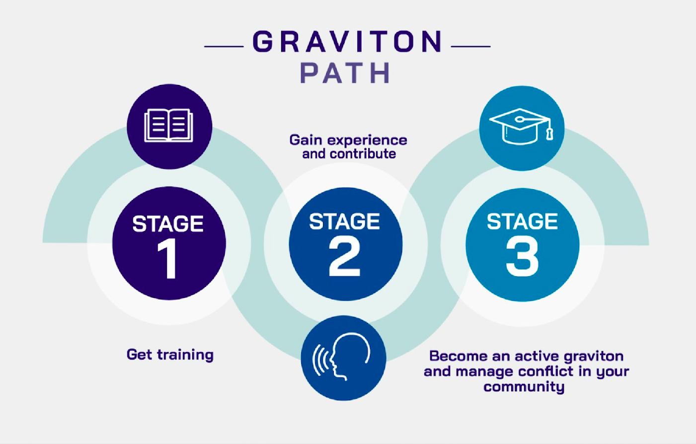

## Expectations

### Gravitons shall be able to:
- Make an effort to be present and accessible to the community, bringing high vibes and improving relationships, bringing the community together.
- Separate the people from problems. Making parties identify with themselves and the other as equals, rather than centering on their own conflictive thoughts-feelings.
- Self-determinate from all parties and recognize key management points by analyzing the information gathered.
- Promote empathy between conflicting parties with emotional intelligence. Building proximity from the abstraction of the problem and the humanization of apparent antithesis.
- Adapt their mindset for tolerance to conflictive situations, keeping calm and diplomacy to stand as an independent third party.
- Propose alternatives to deal with paradoxes while looking for the coexistence and attraction of opposites.
- Act according to institutional regulations while implementing actions to frame unwanted behavior within rules and boundaries (Terms & conditions / Codes of conduct / Graduated sanctions)

## Steps for Alternative Dispute Resolution

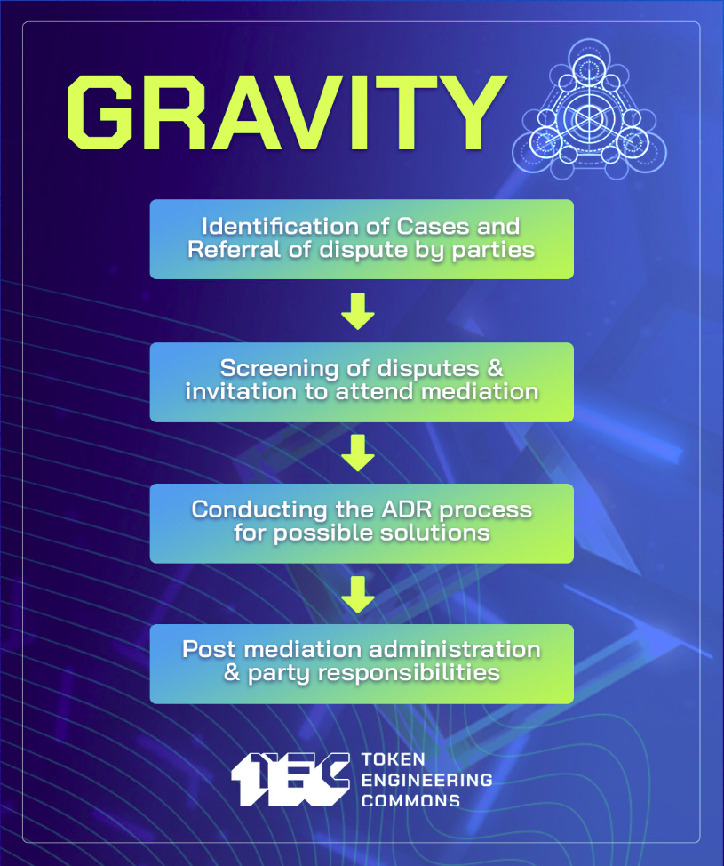

**First**, One or more of the parties to a dispute approaches Gravity and requests support. Gravitons can also propose issues to manage and discuss.

**Second**, The parties provide the Gravitons assigned all the relevant information pertaining to the dispute and are invited to participate in a mediation process that requires their good will and involves a meaningful communication process with caucuses and 

**Third**, Gravity offers premises to frame the dispute in a non adversarial way and to conduct the mediation process aiming to reach a settlement agreement. Gravity keeps a copy of internal forms for evidence and registry.

**Fourth**, Gravity acts as a witness and facilitator of the settlement of the dispute and keeps track of agreements and follow up, but each part acquires responsibilities associated with implementation. if the issue persists, it can scale to other Dispute resolution mechanisms for arbitration or litigation.

<h2 align=left style="clear:left;">CREATING A SAFE SPACE</h2>

### Empathy is the key

Empathy is necessary to be able to apply certain principles of negotiation, as: 
- Separate people from problems 
- Ease communication between conflicting parties
- Focus in interest and not in positions 
- Generate variety of alternative paths to propose solutions
- Use objective or “credibly neutral” criteria to generate legitimacy and impartiality

Empathy brings us together and helps us to take rational and pacific decisions, because individuals who feels underappreciated or ignored are more prone to fall in irrationality just to defend themselves.

## HELPING PEOPLE TO GET TO THEIR OPTIMAL AROUSAL ZONE

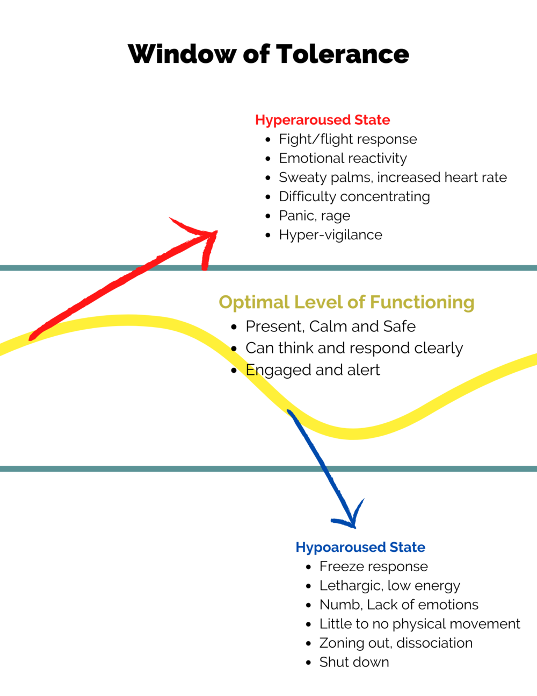

<h3>First actions from the mediator:</h3>

Build confidence, Allow expression, letting steam off, listening carefully, taking notes, asking key questions, identifying feelings, careful language, not trying to influence in any particular idea, just being there to understand the other.

<blockquote>"Trauma can be created by a shock, when its too much too fast, or when its too little too long" - Any of us can get overwhelmed on those situations, where our body triggers the instinctive reactions of flight, fight freeze or fawn. Thanks @MorganxMovement for your teachings today - <a href="https://twitter.com/GravityDAO/status/1534261516458934272">@GravityDAO · Jun 7, 2022</a></blockquote>

<a href="https://apn.com/resources/fight-flight-freeze-fawn-and-flop-responses-to-trauma/">FIGHT, FLIGHT, FREEZE, FAWN, AND FLOP: RESPONSES TO TRAUMA</a>

&nbsp;
&nbsp;
&nbsp;
&nbsp;
&nbsp;
&nbsp;

<h2 style="clear:left;"> Overcoming communication constraints</h2>

### Nonviolent Communication (Giraffe / Wolf language)

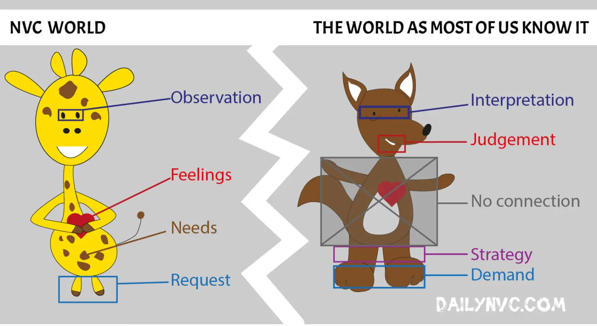

[Marshall Rosenberg on Giraffe/Jackal Language](https://www.youtube.com/watch?v=Xov5z_GJ9Zs)
[Marshall Rosenberg “Giraffe Fuel For Life”](https://www.youtube.com/watch?v=RSwEC4yvrb0)

## The four components of NVC

**NVC - OFNR process**
### OFNR:
- Make **OBSERVATIONS** without evaluations
- Identifying and expressing **FEELINGS** while taking responsibility for them.
- Uncover the fundamental **NEEDS** triggering the parties, moving the conversation to basic levels of human understanding.
- **REQUEST** That Which Would Enrich Life,  instead of making demands.

[The 4 NVC STEPS MADE SIMPLE (VIDEO)](https://www.youtube.com/watch?v=NYkgbrZSAY0)

## The collective consciousness Iceberg

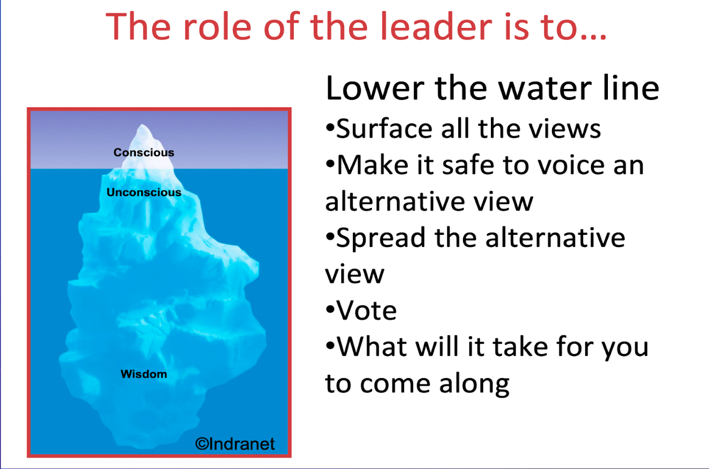

## Liberating Structures Toolbox

Liberating Structures is an open tool-kit for facilitation.

| | | |
|---|---|---|
|    **1-2-4-All**   Engage everyone simultaneously in generating questions/ideas/suggestions | [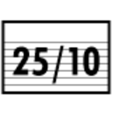](https://www.liberatingstructures.com/12-2510-crowd-sourcing/)   **25-To-10 Crowd Sourcing**   Rapidly generate & sift a group’s most powerful actionable ideas |    **What I Need From You**   Surface essential needs across functions and accept or reject requests for support |
| [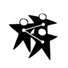](https://www.liberatingstructures.com/2-impromptu-networking/)   **Impromptu Networking**   Rapidly share challenges and expectations, building new connections | [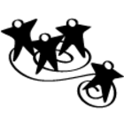](https://www.liberatingstructures.com/13-wise-crowds/)   **Wise Crowds**   Tap the wisdom of the whole group in rapid cycles |    **Open Space**   Liberate inherent action and leadership in large groups |
|    **9 Whys**   Make the purpose of your work together clear |    **Min Specs**   Specify only the absolute “Must do’s” & “Must not do’s” for achieving a purpose |    **Generative Relationships**   Reveal relationship patterns that create surprising value or dysfunctions |
|    **Wicked Questions**   Articulate the paradoxical challenges that a group must confront to succeed |    **Improv Prototyping**   Develop effective solutions to chronic challenges while having serious fun |    **Agreement-Certainty Matrix**   Sort challenges into simple, complicated, complex and chaotic domains | 
|    **Appreciative Interviews**   Discover & build on the root causes of success |    **Helping Heuristics**   Practice progressive methods for helping others, receiving help, and asking for help |    **Simple Ethnography**   Observe and Record Actual Behaviors of Users in the Field | 
|    **TRIZ**   Stop counterproductive activities & behaviors to make space for innovation |    **Conversation Café**   Engage everyone in making sense of profound challenges |    **Integrated~Autonomy**   Move from either-or to robust both-and solutions |
|    **15% Solutions**   Discover & focus on what each person has the freedom and resources to do now |    **User Experience Fishbowl**   Share know-how gained from experience with a larger community | [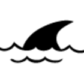](https://www.liberatingstructures.com/30-critical-uncertainties/)   **Critical Uncertainties**   Develop strategies for operating in a range of plausible yet unpredictable futures |
|    **Troika Consulting**   Get practical and imaginative help from colleagues immediately |    **Heard, Seen, Respected**   Practice deeper listening and empathy with colleagues | [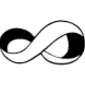](https://www.liberatingstructures.com/31-ecocycle-planning/)   **Ecocycle Planning**   Analyze the full portfolio of activities & relationships to identify obstacles and opportunities for progress |
|    **What, So What, Now What?**   Together, look back on progress to-date and decide what adjustments are needed | [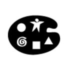](https://www.liberatingstructures.com/20-drawing-together/)   **Drawing Together**   Reveal insights & paths forward through non-verbal expression |    **Panarchy**   Understand how embedded systems interact, evolve, spread innovation, and transform |
| [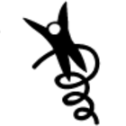](https://www.liberatingstructures.com/10-discovery-action-dialogue/)   **Discovery & Action Dialogue**   Discover, spark & unleash local solutions to chronic problems | [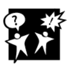](https://www.liberatingstructures.com/21-design-storyboards/)   **Design StoryBoards**   Define step-by-step elements for bringing projects to productive endpoints | [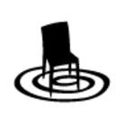](https://www.liberatingstructures.com/22-celebrity-interview/)   **Celebrity Interview**   Reconnect the experience of leaders and experts with people closest to the challenges at hand | 
| [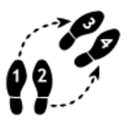](https://www.liberatingstructures.com/11-shift-share/)   **Shift & Share**   Spread good ideas and make informal connections with innovators | [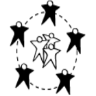](https://www.liberatingstructures.com/23-social-network-webbing/)   **Social Network Webbing**   Map informal connections & decide how to strengthen the network to achieve a purpose |    **Purpose-To-Practice**   Define the five elements that are essential for a resilient & enduring initiative |

## THE 4 P’s - FRAMEWORK FOR CONFLICT ANALYSIS

| | | 
| --- | --- |
| **Possible solutions**   Comparing with references and similes, exploring alternatives, testing the legitimacy of agreements, planning, foreseeing reactions, follow up mechanisms.   (Formulating requests) | **Problem**   Context, Arguments, Aspirations, Scale/Reach of conflict, Recognition, Willingness   (Understanding Feelings) |
| **Process**   Triggering events, ways of fighting, management given, communication,  Chronology.   (Identifying needs) | **People**   Who are the actors?, What is their relationship of power?, What are their interest?   (Observation process) |

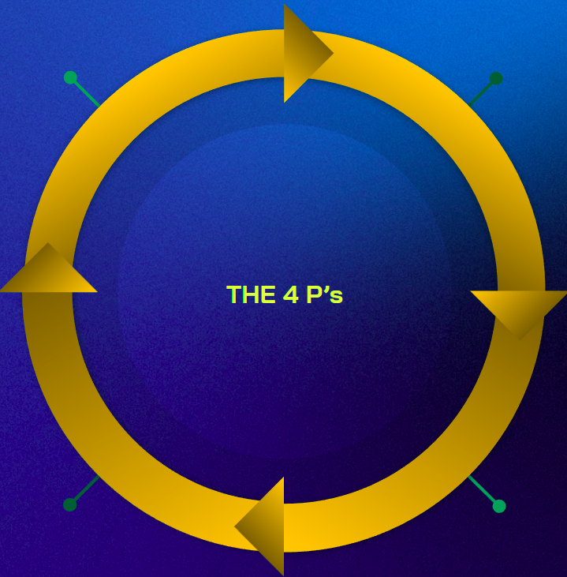

The 4 Ps are an iteration of the PPP model [https://www.law.ox.ac.uk/business-law-blog/blog/2017/03/ppp-negotiation-model-problem-people-and-process](https://www.law.ox.ac.uk/business-law-blog/blog/2017/03/ppp-negotiation-model-problem-people-and-process) 

### The 4 Ps key factors

| Category | Variable | Definition | 
| --- | --- | --- |
| **People** | Main and secondary actors | Who and how many are the parties involved |
| | Power relationship between actors | Institutions and play rules |
| | Feeling of the actors in the conflict (perception) | Emotions triggered and needs at stake |
| **Problem** | Ingredients of the primordial soup | Context, factors that enable the conflict |
| | Faced arguments that boost the conflict | Central aspect of the dispute |
| | Interest that are represented by the parties | Desires, expectations and aspirations of the parties |
| | Reach of the conflict | Scale, status and potential impact of the conflict |
| | Acknowledgement of the conflict | Recognition of the conflictive situation by the parties |
| **Process** | Triggering events and escalation dynamics | facts that have marked the evolution of the conflict |
| | Ways that the conflict has developed | Forms of struggle, interaction with the conflict | 
| | How has the conflict been managed | Communication between actors, who are supportive third parts |
| | Chronology of the conflict | Timeline and time lapse of the situation |
| | Signals for possible escalation | Sensitive topics and actions that can trigger an escalation of the conflict |
| | Comparison with similar conflicts and references | Comparative method |
| **Possible solutions** | Exploring alternative paths for solutions | Multiple answers and possible ways that the conflict can unfold |
| | Legitimacy of decisions | mechanisms to make binding decisions |
| | Envision possible future scenarios | Prospecting and preventing social responses |
| | Mechanisms of implementation | Follow up and accountability for parties responsibility |
| | Short term responses | immediate actions with a direct impact on solving the dispute |
| | Long term transformative actions | Strategies that can help to prevent conflict and build trust | 

## Gravity Mediation Process

**Mediation flow** 
- Needs the good will of the parties to engage in a meaningful communication process, without this, there are other means of resolving disputes that can be more effective and efficient.
- We make caucuses (private meetings) with all the parties involved to identify common ground and prepare a joint conversation
- The post mediation process can be outlined in settlement agreements, but also gains legitimacy from follow up and implementation 

&nbsp;
&nbsp;
&nbsp;
&nbsp;
&nbsp;
&nbsp;

<h2 style="clear:left;">GUIDING QUESTIONS</h2>

Not talking about the past
Not pointing out individual responsibilities, avoid focusing on names
It's not necessary to make all the questions at once, when people start opening, catch the relevant information.

- How do we end something not desired and build something we do desire?
- Could you describe the conflicting situation that happened?
- What happened?
- Why do you think it happened?
- What would be the best possible outcome for you?
- What are you willing to compromise / negotiate in this process?
- What would be the worst case scenario for you in this situation?
- How would you like to feel after what happened? 
- What are your needs in this situation?
- What do you think can be done to restore the relationship and build trust?
- What can we learn from this?
- How can we apply these learnings?

## GRAVITY FORMS 
(FREE TO USE - JUST FORK THEM)

**First approach**: Hello XXXX How are you? my name is XXXX and Im a facilitator of conflict management in DAOs. Thank you for your input to the Gravity typeform. I'm reaching out with the intention of supporting meaningful communication processes, and building common ground for possible agreements that meet the needs of the parts involved. Would you be interested in having a meeting to talk on the issue? 

- [Observation form](https://docs.google.com/document/d/1LbytXdLBu3XC9BBTQA6aiZYPC02j-fxcRoiqtUDdGyg/edit)
- [Mediation form](https://docs.google.com/document/d/1RgL9QANBhq6KqtETCYEEEsFSJvHUw0K5VD58qWPUBTk/edit)
- [Venn Diagram (OFNR + 4Ps)](https://docs.google.com/presentation/d/1vZsWR6mO8aFRvpjuILmfVYlQXRVg_SxTvuvErjtinCg/edit?usp=sharing)

## MAPPING OBSERVATION PROCESS BATNA

## KEEPING A REGISTRY FOR TRANSPARENCY AND ACCOUNTABILITY
We use [Dework](https://app.dework.xyz/gravity-dao/trust-creation-trai), integrated with zenhub and Discord

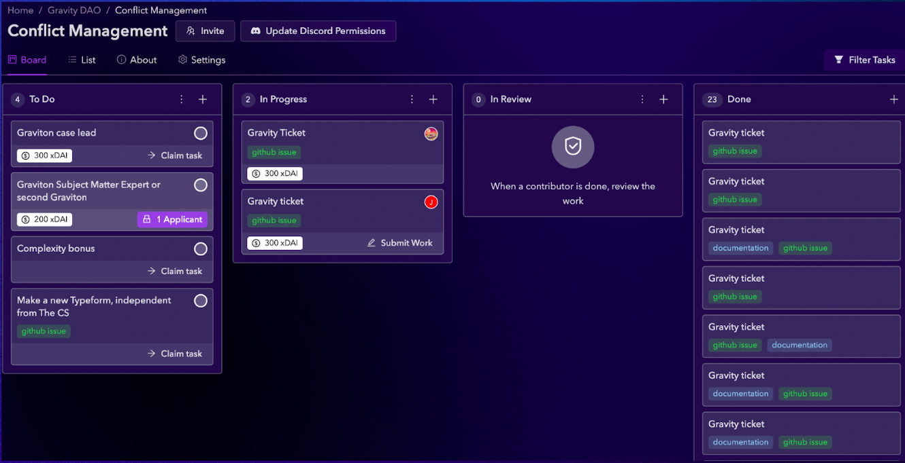

## Designing an agreement

Google docs are ok, but we are soon moving to Unbreakable vows

https://unbreakable-vows.on.fleek.co/#/create

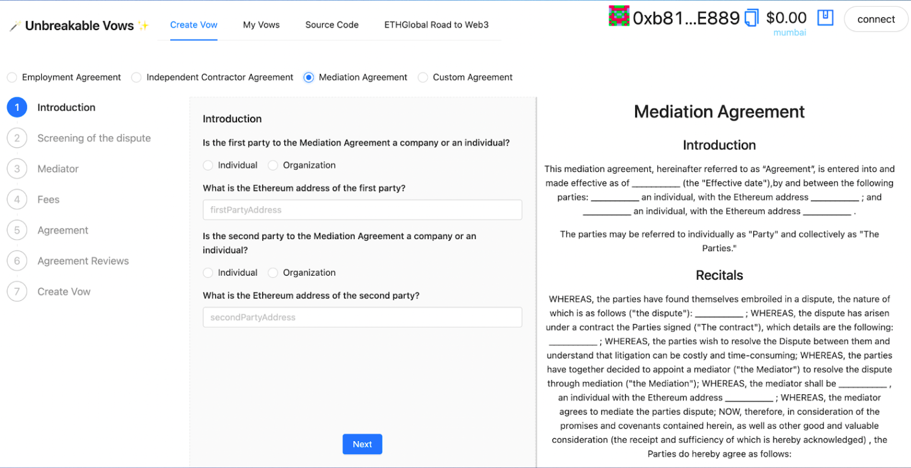

## Conflict Transformation Platform

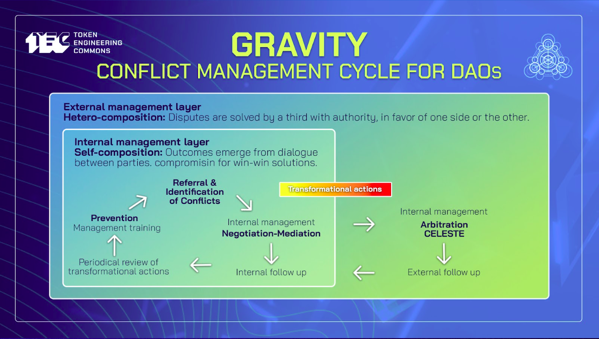

## Gravity Training Session #9

**Proposed situations:**

1. A DAO is debating on how to better govern itself. A part of the community thinks that there should be a small group of 5 to 10 core contributors having leadership roles, and other part of the community thinks that decentralized projects don't need to have a closed leadership. How to foster collective wisdom?

**Proposed tool:** _Centralization vs Decentralization:_ Deep Democracy debate and polarity mapping 

2. You designed a proposal for a DAO along with some colleagues, the proposal was funded and when you started working, frictions started arising. Some of the work was being delayed while the communication was getting worse with the team. The intended impact was not being achieved, and there is no intention of further funding for a continuation of the work being done. Besides looking for alternatives to continue contributing in the DAO, what to do with the relationships that were broken?

**Proposed tool:** _NVC practice:_ assertive communication, mediation.

3. You are loaded with work and you are failing to deliver some of the things that you were supposed to do. You notice that you are not being able to join some of the calls you normally like to participate, and you are leaving a bad impression with the people you were working with. You are not sleeping well and feeling a lot of pressure on your shoulders. You feel that you are blowing things even accidentally. What do you do now?

**Proposed tool:** _Mental health:_ Slow dojo. Communicational bridges and safe spaces. Mental health awareness.

4. You agreed to mediate in a case, and when you are in the first private meeting with one of the parties, they get hyper aroused and start getting triggered by strong emotions. Shortly you find yourself without control of the call, hearing that the mediation process wouldn’t make a difference and being in the position trying to manage and de escalate their reactions without revictimizing or undervaluing the feelings of the party. Your intention is to invite them to trust the mediation process and to have another private meeting, where hopefully, there could be some progress on getting information about what happened, setting a safe space for them to remain in their optimal arousal zone.

**Proposed tool:** _Trauma informed decisions - Harm reduction._

5. One of your teammates is often expressing a different point of view from the main voice that the group takes, The leader of the team thinks that their comments slows down the work, and start trying to avoid giving them space to talk in calls. Shortly after, gossip starts arising that the leader is imposing their ideas and other people in the team agrees with the silenced minority. What to do now?

**Proposed tool:** _Lowering the waterline - Including no voices_

6. A DAO started to fund to some contributors to make a pilot program inside their community. Shortly after the agreement was done, the market dropped 40% and core DAO contributors decided to strengthen financial priorities, cutting the funding to that project and not being able to implement the initial agreement. What to do now?

**Proposed tool:** _Escalation mechanisms - Expectation settings - Unexpected changes._

## OFNR + 4 Ps

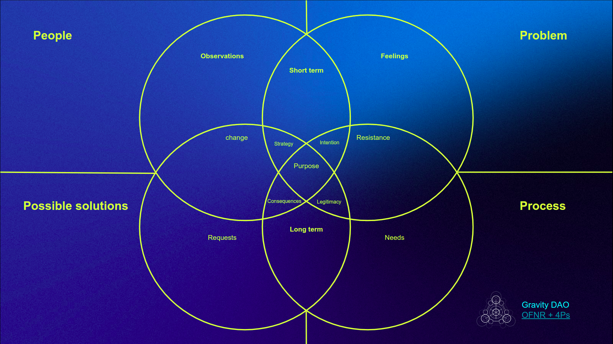

## Ho Oponopono

#### ありがとう - Te Amo - Désolé - I’m sorry
#### Gracias - Je t’aime - Forgive me, ごめんなさい
#### Thank you - 愛してる - Lo siento - Pardonnez-moi
#### Merci - I love you - すみません - I’m Sorry

[https://www.youtube.com/watch?v=OAuWRuU4uzA](https://www.youtube.com/watch?v=OAuWRuU4uzA)

## Role Play

### Whose fault is it anyways? 

**Description**: you are working on a project in a DAO and you have been preparing for some months to make a public announcement about the release date of your next DeFi tool. Until some weeks ago, the planned date was set in July according to the initial roadmap. But **in last week's team call, one of the lead developers found a critical fail in the smart contracts that allowed re entrancy attacks**. 

It turns out that the **announcement got published on medium that same weekend, saying that the release date would be in July, without mentioning the critical bottleneck** in the smart contracts that could delay the release by a few months. In a public chat, contributors of the team start blaming each other for what happened. The rest of the DAO suggests that the writers and the publishing team has to take shared responsibility and propose alternatives to deal with the situation. 

What do you do now?  Part A: (Writer) Part B: (Publisher) Part C: (Lead dev)

Topics: Error culture. Shared responsibilities. Reconciliation.
